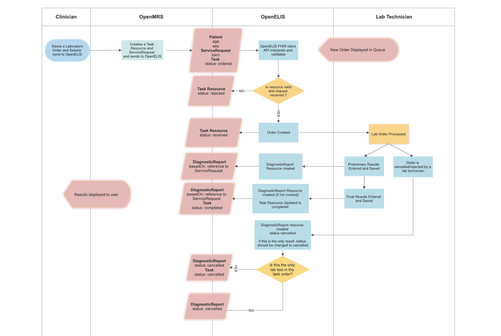
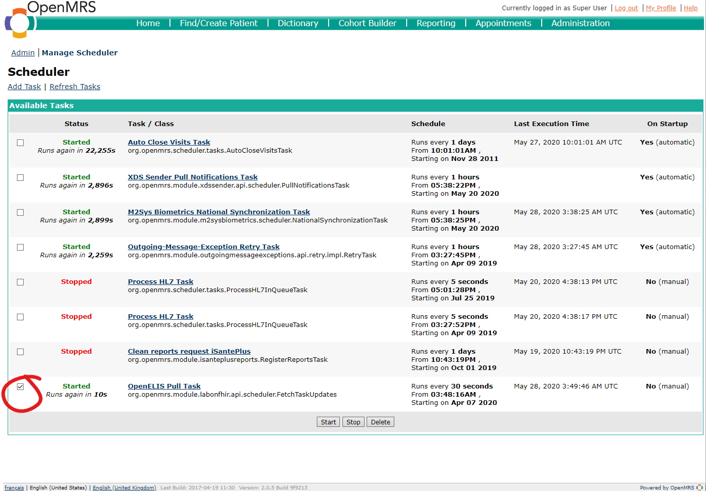
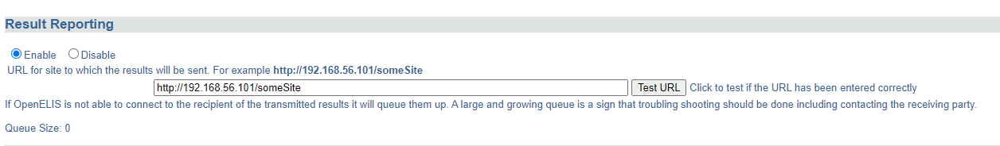

# Lab Orders and Results exchange between OpenMRS and OpenELIS

The Lab Order workflow between OpenELIS and [OpenMRS](http://openmrs.org) will use the [OpenMRS FHIR Workflow Module](https://www.hl7.org/fhir/workflow-module.html) and suggested [Communication Patterns](https://www.hl7.org/fhir/workflow-communications.html#12.6.2.1) to implement the ordering of lab tests from OpenMRS to OpenELIS and the returning the results to OpenMRS.

The current communication workflow uses HL7 V2.5.1 messages as documented here: (https://github.com/openelisglobal/openelisglobal-core/wiki/Result-Reporting). This functionality is implemented in [openmrs-module-labintegration](https://github.com/IsantePlus/openmrs-module-labintegration), an OpenMRS module made for an implementation of OpenMRS deployed in Haiti called [iSantePlus](https://github.com/IsantePlus).  

##Communication Overview



##Implementation Guide
###iSantéPlus
1. Install iSantePlus using one of the following approaches:
	
	1. Docker: https://github.com/IsantePlus/isanteplus-docker
	
	1. Apache Tomcat WAR: [SOP iSantePlus Installation.docx](https://wiki.openmrs.org/download/attachments/235274282/SOP%20iSantePlus%20Installation.docx?version=1&modificationDate=1590637509000&api=v2)

1. [Install](https://wiki.openmrs.org/display/docs/Administering+Modules) the [OpenMRS FHIR module](https://github.com/pmanko/openmrs-module-isanteplus-labonfhir) using the following omod file: [openmrs-module-fhir2.omod](https://drive.google.com/file/d/1SSlVrChKQ6i0zVbUgzR7Blx_czjiJhcG/view?usp=sharing)

1. Install the iSantePlus Lab on FHIR module using the following omod file: labonfhir-1.0.0-SNAPSHOT.omod

1. Restart iSantePlus

Start up the OpenELIS Update Task in `System Administration` → `Advanced Administration` → `Scheduler` → `Manage Scheduler`



###OpenELIS Global 2.x
1. Install OpenELIS Global 2.x using the instructions [HERE](../install)
1. Navigate to the "results reporting" configuration: https://IPforyourserver:8443/OpenELIS-Global/ResultReportingConfiguration.do
1. Move the radio button for Result Reporting to "Enable" and enter in the URL for the OpenMRS connection like in the example below. 
	* Please note, the Test URL button may not respond to the FHIR module, so please disregard any errors if you click it.  
1. Click Save at the bottom of the page. 



##Required FHIR Resources
###Task
> [more info](https://wiki.openmrs.org/display/projects/Task+Resource)

The Task resource is created along with the corresponding ServiceRequest resource when a clinician creates a TestOrder and decides to send it to OpenELIS.

This resource is used to track the status of the lab order request from initiation to completion, and as a container for all other resources related to the given order.

*Example Task:*
```
{
    "resourceType": "Task",
    "id": "88ffa7fb-0419-4097-8b45-24f0d843c5ea",
    "identifier": [
        {
            "system": "http://isanteplus.org/ext/task/identifier",
            "value": "88ffa7fb-0419-4097-8b45-24f0d843c5ea"
        }
    ],
    "basedOn": [
        {
            "reference": "ServiceRequest/ebf83ba0-9d3c-497f-9aa0-d839ec506202",
            "type": "ServiceRequest"
        },
        {
            "reference": "ServiceRequest/73e96ecb-a78d-41c8-a55f-d9b90f759e5f",
            "type": "ServiceRequest"
        }
    ],
    "status": "requested",
    "intent": "order",
    "for": {
        "reference": "Patient/e14e9bda-d273-4c74-8509-5732a4ebaf19",
        "type": "Patient"
    },
    "encounter": {
        "reference": "Encounter/7f5aabd9-6375-47c8-a8d6-30f219b6e2f1",
        "type": "Encounter"
    },
    "authoredOn": "2020-04-28T17:33:19+00:00",
    "owner": {
        "reference": "Practitioner/f9badd80-ab76-11e2-9e96-0800200c9a66",
        "type": "Practitioner"
    }
}
```
###ServiceRequest
> [more info](https://wiki.openmrs.org/display/projects/ServiceRequest+Resource)

The ServiceRequest resource represents the TestOrder placed in OpenMRS. It is referenced from the Task with the Task.basedOn element, and sent to OpenELIS with the Task to initiate the processing of the order. 

*Example Service Request:*
```
{
    "resourceType": "ServiceRequest",
    "id": "73e96ecb-a78d-41c8-a55f-d9b90f759e5f",
    "status": "active",
    "intent": "order",
    "code": {
        "coding": [
            {
                "code": "790AAAAAAAAAAAAAAAAAAAAAAAAAAAAAAAAA"
            },
            {
                "system": "http://loinc.org",
                "code": "14682-9"
            },
            {
                "system": "urn:oid:2.16.840.1.113883.3.7201",
                "code": "790"
            }
        ]
    },
    "subject": {
        "reference": "Patient/e14e9bda-d273-4c74-8509-5732a4ebaf19",
        "type": "Patient"
    },
    "encounter": {
        "reference": "Encounter/7f5aabd9-6375-47c8-a8d6-30f219b6e2f1",
        "type": "Encounter"
    }
}
```
###DiagnosticReport
> [more info](https://wiki.openmrs.org/display/projects/DiagnosticReport+Resource)

The DiagnosticReport resource  is the container for the results of an Order, and holds these results in the DiagnosticReport.result element as references to Observation resources. 

*Example Diagnostic Report*
```
{
  "resourceType": "DiagnosticReport",
  "id": "93",
  "meta": {
    "versionId": "1",
    "lastUpdated": "2020-04-28T17:33:36.163+00:00",
    "source": "#55t4lpDZF4q3TCZ0"
  },
  "text": {
    "status": "generated",
    "div": "<div xmlns=\"http://www.w3.org/1999/xhtml\"><div class=\"hapiHeaderText\"> Untitled Diagnostic Report </div><table class=\"hapiPropertyTable\"><tbody><tr><td>Status</td><td>FINAL</td></tr></tbody></table></div>"
  },
  "identifier": [
    {
      "system": "https://isanteplusdemo.com/openmrs/ws/fhir2/",
      "value": "ebf83ba0-9d3c-497f-9aa0-d839ec506202"
    }
  ],
  "status": "final",
  "code": {
    "coding": [
      {
        "code": "1008AAAAAAAAAAAAAAAAAAAAAAAAAAAAAAAA"
      },
      {
        "system": "http://loinc.org",
        "code": "22748-8"
      },
      {
        "system": "urn:oid:2.16.840.1.113883.3.7201",
        "code": "1008"
      }
    ]
  },
  "subject": {
    "reference": "Patient/2"
  },
  "result": [
    {
      "reference": "Observation/92",
      "type": "Observation"
    }
  ]
}
```
###Observation
> [more info](https://wiki.openmrs.org/display/projects/Observation+Resource)

The Observation resource contains the results of the Lab Order request.

*Example Observation:*

```
{
  "resourceType": "Observation",
  "id": "92",
  "meta": {
    "versionId": "1",
    "lastUpdated": "2020-04-28T17:33:36.124+00:00",
    "source": "#xAVz0uUE6c3l42Za"
  },
  "identifier": [
    {
      "system": "https://isanteplusdemo.com/openmrs/ws/fhir2/",
      "value": "ebf83ba0-9d3c-497f-9aa0-d839ec506202"
    }
  ],
  "status": "final",
  "code": {
    "coding": [
      {
        "code": "1008AAAAAAAAAAAAAAAAAAAAAAAAAAAAAAAA"
      },
      {
        "system": "http://loinc.org",
        "code": "22748-8"
      },
      {
        "system": "urn:oid:2.16.840.1.113883.3.7201",
        "code": "1008"
      }
    ]
  },
  "subject": {
    "reference": "Patient/2"
  },
  "valueQuantity": {
    "value": 55,
    "unit": "UI/L"
  }
}
```
###Patient

> [more info](https://wiki.openmrs.org/display/projects/Patient+Resource)

The Patient resource contains vital information for OpenELIS to fullfill the lab order request, and is referenced by the Task.

Example Patient:

```
{
    "resourceType": "Patient",
    "id": "e14e9bda-d273-4c74-8509-5732a4ebaf19",
    "identifier": [
        {
            "id": "5981a256-d60c-44b1-beae-9bdd2cf572f8",
            "use": "official",
            "system": "iSantePlus ID",
            "value": "10012R"
        },
        {
            "id": "75a67d54-6fff-44d1-9c3e-2116c967b475",
            "use": "usual",
            "system": "Code National",
            "value": "100000"
        },
        {
            "id": "29447d21-3cd6-42a9-9ab2-79ebfa710a01",
            "use": "usual",
            "system": "ECID",
            "value": "04d759e0-5d02-11e8-b899-0242ac12000b"
        }
    ],
    "active": true,
    "name": [
        {
            "id": "511275de-e301-44a3-95d2-28d0d3b35387",
            "family": "Mankowski",
            "given": [
                "Piotr"
            ]
        }
    ],
    "gender": "male",
    "birthDate": "1987-01-01",
    "deceasedBoolean": false,
    "address": [
        {
            "id": "d4f7c809-3d01-4032-b64d-4c22e8eccbbc",
            "use": "home",
            "country": "Haiti"
        }
    ]
}

```

##Relevant FHIR Docs
* [Using Tasks in a RESTful Context](https://www.hl7.org/fhir/task.html#12.1.2.1)
* [Workflow Module](https://www.hl7.org/fhir/workflow-module.html)
* [Diagnostic Module](https://www.hl7.org/fhir/diagnostics-module.html)
* [Example: Workflow states for a lab order for a blood test](https://www.hl7.org/fhir/workflow-communications.html#12.6.2.1)
* [Option G: POST of Task to fulfiller's system](https://www.hl7.org/fhir/workflow-management.html#optiong)

## Relevant OpenMRS Talk Posts
[The handling and mapping of lab order status for the lab workflow](https://talk.openmrs.org/t/the-handling-and-mapping-of-lab-order-status-for-the-lab-workflow/26348)


 
