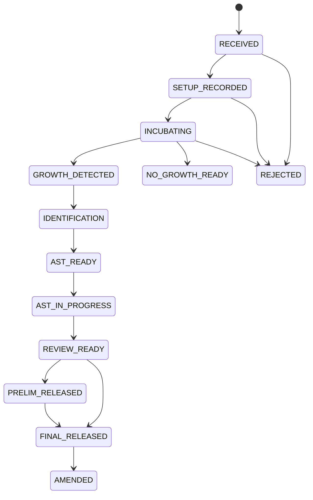

# Data Model: Microbiology MVP Workflow

This model is for implementation planning. It intentionally goes beyond the
product spec and may be refined during milestone tasks.

## Existing Anchors To Reuse

- `SampleItem`: physical specimen anchor for case identity.
- `Test`: ordered/catalog test; already has `domain` and
  `antimicrobialResistance`.
- `test_amr_config` and `whonet_antibiotic_codes`: existing AMR/WHONET
  groundwork.
- `Method` and `TestMethod`: existing test method/default-method configuration.
- `TestResultComponent`: supports labeled result components and
  `allow_multiple_readings`.
- `Result`, `Analysis`, result validation/reporting services: reuse for final
  reportable outputs where feasible.
- `Alert`: operational surfacing for critical microbiology communications.
- `WHONetReportService`: existing surveillance export path to extend.

## New Reference Concepts

### MicroWorkflowType

Enumeration for workflow routing and case identity.

- `BACTERIOLOGY`
- `MYCOBACTERIOLOGY_TB` reserved for TB cycle
- `MYCOLOGY` reserved for future cycle

Validation:

- MVP creates only `BACTERIOLOGY` cases.
- Reserved values may be stored in reference configuration but must not expose
  incomplete workflow screens as usable features.

### MicroCultureSetupRecipe

Microbiology metadata for a culture setup method.

Fields:

- `id`
- `methodId`
- `name`
- `workflowType`
- `mediaDefaults`
- `incubationDefaults`
- `incubationHours` (optional positive integer)
- `subcultureAtHours` (optional positive integer)
- `maxIncubationDays` (optional positive integer)
- `atmosphereDefaults`
- `active`
- `lastUpdated`

Relationships:

- References existing `Method`.
- May be selected by default from a test's default method.

Validation:

- Active routine bacteriology tests must resolve to a usable recipe before case
  setup.
- Missing recipe blocks setup with a clear configuration error.

### MicroOrganism

Organism reference entry for identification and WHONET readiness.

Fields:

- `id`
- `displayName`
- `shortName`
- `whonetCode`
- `oclCode`
- `organismGroup`
- `active`
- `lastUpdated`

Validation:

- Active organism names must be unique within a deployment.
- WHONET readiness flags organisms without an export mapping.

### MicroAntibiotic

Antibiotic reference entry for AST panels and WHONET readiness.

Fields:

- `id`
- `displayName`
- `whonetCode`
- `antibioticClass`
- `active`
- `lastUpdated`

Relationships:

- May reuse or mirror `whonet_antibiotic_codes` for the WHONET code list.

Validation:

- WHONET-ready antibiotics require a WHONET code.

### MicroPatientOrigin

Deployment reference entry for order-time patient context and surveillance.

Fields:

- `id` (generated UUID)
- `code` (stable application identity)
- `displayName`
- `whonetCode`
- `active`
- `sortOrder`
- `lastUpdated`

Validation:

- Phase 1A seeds Inpatient, Outpatient, ICU, Emergency, Long-term Care, and
  Unknown with their ruled WHONET codes.
- Order-detail writes accept only an active stable code or a blank optional
  value; free text is rejected.
- The Phase 1A administration surface is read-only. Full vocabulary CRUD is a
  later deployment need.

### MicroPatientOriginDefault

Optional deployment mapping from an existing requesting Organization to one
active Patient Origin. It is deliberately explicit: the source does not define
how organization names or ward types imply patient origin.

Fields:

- `id` (generated UUID)
- `organizationId` (unique)
- `patientOriginId`
- `lastUpdated`

Validation:

- A missing, inactive, or invalid mapping produces no default.
- The UI never overwrites an origin already selected or restored on the order.

### MicroBreakpointStandard

Versioned AST interpretation standard.

Fields:

- `id`
- `authority` such as `CLSI` or `EUCAST`
- `version`
- `effectiveDate`
- `active`
- `lastUpdated`

Validation:

- A reading can be interpreted only when a matching active standard/rule exists.
- No-breakpoint results remain saveable but are marked for manual judgment.

### MicroAstPanel

Reusable AST panel for organism/specimen/workflow contexts.

Fields:

- `id`
- `name`
- `workflowType`
- `organismGroup`
- `specimenTypeId`
- `active`
- `lastUpdated`

Relationships:

- Has many panel antibiotics.
- Referenced when starting AST for an isolate.

## New Workflow Entities

### MicroCase

One microbiology workflow for one physical specimen.

Fields:

- `id`
- `sampleItemId`
- `workflowType`
- `stage`
- `priority`
- `cultureMethodId`
- `createdAt`
- `createdBy`
- `lastUpdated`
- `closedAt`
- `closedBy`
- `finalReleaseState`

Relationships:

- References one existing `SampleItem`.
- Has many `MicroCaseActivity`.
- Has zero or many `MicroIsolate`.
- Has zero or many `MicroCriticalCommunication`.

Uniqueness:

- Unique on `sampleItemId + workflowType`.

State transitions:

Validation:

- Final release requires all required isolate, AST, review, and critical
  follow-up work to be complete.
- Rejected/lost cases require reason and actor/time.
- Sibling workflows are found through shared `sampleItemId`.

### MicroCaseOrderDetail

The order-entry context captured before collection and retained for the resulting
microbiology case. During `/order/enter`, the record is a Sample-owned draft so
the supported `/order/collect` reload cannot discard entered details before a
physical SampleItem and case exist. Routing copies the draft into a Case-owned
record through services; it is not fixture or UI-only state.

Fields:

- `id`
- `caseId` (nullable while the record is a Sample-owned draft)
- `sampleId` (nullable after routing; unique while draft-owned)
- `cultureMethodId`
- `patientOrigin`
- `numberOfSets` (1-10)
- `clinicalHistory` (maximum 1000 characters)
- `antibioticExposure` (nullable boolean)
- `criticalNotificationPreference` (nullable boolean)
- audit actor/time fields

Relationships and constraints:

- Exactly one owner is present: `caseId` XOR `sampleId`.
- A Sample has at most one order-entry draft; a MicroCase has at most one final
  order-detail record.
- `cultureMethodId` preserves the selected existing `Method` while the case does
  not yet exist. Routing applies it to `MicroCase.cultureMethodId`; this record
  does not introduce a second protocol master.
- `patientOrigin` stores the validated stable `MicroPatientOrigin.code`; both
  order entry and the case panel obtain labels and WHONET identity from the
  reference service. This preserves existing order-detail compatibility without
  making the product contract depend on a particular foreign-key layout.
- Macro expansion is not persisted here. Clinical History will consume the
  separately owned Macro Library when that feature is available.

### MicroCaseActivity

Timeline event for case actions and observations.

Fields:

- `id`
- `caseId`
- `activityType`
- `occurredAt`
- `performedBy`
- `note`
- `structuredData`
- `lastUpdated`

Validation:

- Activity type must be valid for the current case stage.
- Actor/time are required for clinical/audit events.

### MicroIsolate

Distinct organism identified from the case.

Fields:

- `id`
- `caseId`
- `isolateLabel`
- `gramStain`
- `colonyMorphology`
- `organismId`
- `preliminaryOrganismText`
- `identificationMethod`
- `identificationConfidence`
- `significance`
- `identificationStatus`
- `createdAt`
- `lastUpdated`

Relationships:

- Belongs to one `MicroCase`.
- Has zero or many `MicroAstRun`.

Validation:

- Creation records Gram stain and colony morphology while organism identity is
  pending.
- AST setup requires confirmed organism identification.
- Identification and reidentification preserve the prior organism, method,
  confidence, significance, actor, time, and reason in immutable history.

### MicroAstRun

AST workflow for one isolate, one ordered panel, and one laboratory technique.

Fields:

- `id`
- `isolateId`
- `panelId`
- `panelVersion`
- `panelProvenance`
- `panelAdjustmentReason`
- `technique`
- `measurementType` (persisted in the legacy `method` column)
- `breakpointStandardId`
- `breakpointVersion`
- `status`
- `analyzerInstrumentId`
- `analyzerCardId`
- `analyzerSoftwareVersion`
- `analyzerOrganismId`
- `analyzerOrganismName`
- `analyzerOrganismConfidence`
- `analyzerExpertFlags`
- `instrumentQcReference`
- `qcState`
- `qcOverrideReason`
- `analyzerLoadedAt`
- `analyzerCompletedAt`
- `analyzerMessageCodes`
- `sourceEventId`
- `startedAt`
- `reviewedAt`
- `reviewedBy`
- `repeatReason`
- `lastUpdated`

Relationships:

- Belongs to one `MicroIsolate`.
- Has an immutable ordered set of `MicroAstRunAntibiotic` rows.
- Has many `MicroAstReading`.

Validation:

- Only reviewed AST can satisfy final release readiness.
- Analyzer-backed work moves through `AWAITING_RESULTS`, `RESULTS_IN`, and
  either reviewed completion or an explicit QC/repeat resolution. Analyzer
  expert flags, missing breakpoints, and interpretation mismatches block review
  until resolved.
- Analyzer organism identity is retained as evidence only. It never replaces
  the case isolate identity without a separate identified-user action.
- QC override and analyzer-flag acknowledgment require an authenticated actor,
  time, and reason. Invalidation preserves the failed run and creates a linked
  replacement run.
- A supported technique deterministically derives MIC or zone measurement type;
  clients do not classify the same reading independently.
- Historical rows backfill to an explicit legacy-unspecified technique according
  to their stored measurement type and require a real technique for new work.
- Repeat/retest creates a new run or linked repeat record rather than
  overwriting prior readings.
- Whole-panel repeat copies the source ordered-work snapshot. Single-antibiotic
  repeat copies only the selected source member and rejects any drug that was
  not part of the preserved source run.
- A nonconformance Retest disposition records the NCE and invokes the same
  preserved-run operation after verifying that the source belongs to the case.

### MicroAstRunAntibiotic

Immutable ordered-work snapshot for one antibiotic expected on an AST run.

Fields:

- `id`
- `astRunId`
- `antibioticId`
- `displayOrder`
- `tier`
- `reportBehavior`

Validation:

- Run creation copies the selected panel's exact ordered membership inside the
  same transaction as the run.
- Later panel administration does not change an in-flight or historical run.
- Repeat runs inherit the source run's snapshot rather than reading the current
  panel definition.
- A reading must belong to the run snapshot.
- Any panel switch or individual drug addition/removal requires one retained
  adjustment reason and produces the exact snapshot used by entry and review.
- Review is blocked until every snapshotted antibiotic has at least one
  reading.
- Standard patient-report projection emits only the latest reading for each
  snapshotted antibiotic, in snapshot display order; superseded and unordered
  readings are excluded.
- The snapshot does not create a parallel core `Analysis` per antibiotic; the
  case's linked culture analysis remains the standard report projection anchor.

### MicroAstReading

Antibiotic result inside an AST run.

Fields:

- `id`
- `astRunId`
- `antibioticId`
- `measurementType` (MIC or ZONE; persisted in the legacy `method` column)
- `rawValue`
- `rawText`
- `units`
- `interpretation`
- `instrumentInterpretation`
- `analyzerResultReference`
- `source`
- `matchedBy`
- `overrideReason`
- `overrideInterpretation`
- `breakpointRuleId`
- `createdAt`
- `createdBy`

Validation:

- Override requires a reason and preserves the original interpreted value.
- A found unscoped rule records `matchedBy=STANDARD`; `matchedBy=NONE` is
  reserved for an absent rule so review does not confuse a generic standard
  interpretation with a missing breakpoint.
- Missing breakpoint records `matchedBy=NONE` and requires visible local-policy
  guidance rather than silently implying an interpretation.
- Numeric readings validate precision and allowed ranges by the run's derived
  measurement type.
- A reading inherits measurement type from its run technique; request payloads
  cannot override it.
- Analyzer interpretation and result reference remain distinguishable from the
  OpenELIS interpretation and any later human override.

### MicroAstOverrideEvent

Append-only override and revert history for an AST reading.

Fields:

- `id`
- `readingId`
- `action`
- `fromInterpretation`
- `toInterpretation`
- `reason`
- `performedAt`
- `performedBy`

Validation:

- Every override or revert appends an event; prior events are never updated.
- Revert requires an active override and a non-empty reason.
- The original reading value, interpretation, source, rule, and measurement are
  never replaced by override history.

### AnalyzerEvent

Durable, idempotent envelope for normalized events delivered by analyzer
runtime integrations before a feature-specific consumer applies them.

Fields:

- `id`
- `externalEventId`
- `eventType`
- `analyzerId`
- `sourceId`
- `payload`
- `status`
- `targetReference`
- `failureReason`
- `receivedAt`
- `processedAt`

Validation:

- `externalEventId` is unique so retries cannot duplicate clinical work.
- AST consumers accept result-available and QC-failure events and resolve the
  target by explicit run or analyzer/card identity.
- The culture consumer accepts a positive signal only for an incubating case,
  resolved by an explicit case reference or one unique recorded culture-
  container identifier. A positive signal does not imply confirmed growth.
- Events that cannot be applied remain durable with a named failure and appear
  in the existing Analyzer Import Issues reconciliation surface.

The durable case stage constraint includes `POSITIVE_SIGNAL` between incubation
and confirmed growth. Migration `079-microbiology-positive-culture-stage.xml`
also reconciles the constraint with the existing lost-specimen terminal states;
routes, worklist filters, and confirmation panels require no schema changes.

### Shared Reagent Lot Selection (No New Microbiology Model)

Culture setup and AST setup consume existing Test Catalog reagent links and
Inventory lots through one shared picker. Inventory remains authoritative for
lot status, QC, expiry, quantity, locked consumption, and usage records;
Microbiology stores only its existing action-to-usage provenance link.

Validation:

- Eligibility is revalidated by Inventory inside the save transaction.
- A failed revalidation creates neither consumption nor a microbiology usage
  link and returns the stable reason plus lot number.
- `PRIMARY` and `SECONDARY` are catalog reagent roles, not required, optional,
  or substitute selection policies.
- Required/optional/substitute behavior cannot be enforced until the shared
  Test Catalog contract supplies those semantics; Microbiology must not add a
  parallel policy model.

### MicroCriticalCommunication

Clinical call/read-back communication log for urgent microbiology findings.

Fields:

- `id`
- `targetType`
- `targetId`
- `caseId`
- `recipientName`
- `recipientContact`
- `message`
- `method`
- `communicationStatus`
- `communicatedAt`
- `communicatedBy`
- `acknowledgedAt`
- `acknowledgedBy`
- `followUpRequired`
- `linkedAlertId`
- `lastUpdated`

Relationships:

- May link to one generic `Alert`.
- Targets case, isolate, sample, or result context.

Validation:

- Recipient may be free text when provider directory data is incomplete.
- Critical communication cannot be deleted after creation; correction is an
  additional activity/log entry.

## Computed Views

### MicrobiologyWorklist

Computed service response, not a dedicated table for MVP.

Fields:

- `rowId`
- `rowId`
- `grain`
- `caseId`
- `accessionNumber`
- `sampleItemId`
- `patientDisplay`
- `specimenDisplay`
- `workflowType`
- `stage`
- `priority`
- `dueAction`
- `urgency`
- `needsAstReview`
- `hasOpenCriticalCommunication`
- `siblingWorkflows`
- `createdAt`
- `lastActivityAt`
- `lastActivityBy`
- Culture projection: `stage`, `dueAction`, sibling-workflow context, and
  analyzer-results-in indicator.
- AST projection: `isolateId`, isolate label, organism display, run identity,
  panel identity and display name, run status, start time, and analyzer-results-
  in indicator.

Accession, patient, specimen, panel display, and latest-activity actor are
read-time projections from their existing authoritative records. They are not
duplicated into microbiology tables and require no schema migration.

The worklist page also carries:

- the 25 most recent typed case activities across open cases, with accession,
  actor, time, and note;
- today's ESBL, MRSA, CRE, VRE, and MDR counts derived from structured analyzer
  flags;
- no manually inferred resistance categories from free-text override reasons.

An identified clinically significant isolate without an active AST attempt is
represented as pending setup. Invalidated, cancelled, and superseded attempts
do not inflate the live queue. This is a computed projection and requires no
schema migration.

Validation:

- Filters and sorting must be stable for at least 200 in-flight seeded cases.

### CaseReadiness

Server-computed release gates and AST progress for one case.

Fields:

- `finalReleaseReady`
- `blockers`
- `astRunsComplete`
- `astRunsTotal`
- `significantIsolatesAwaitingAstSetup`
- `isolatesPendingIdentification`

Validation:

- Only reviewed/accepted AST runs count as complete.
- Invalidated and rerun-required historical attempts remain visible but do not
  inflate the active-run denominator.
- A confirmed clinically significant isolate with no active run counts as
  awaiting setup.
- Any isolate without confirmed organism identity counts as pending
  identification and blocks final release with a named reason.

### WhonetReadiness

Computed readiness result over finalized microbiology cases.

Fields:

- `caseId`
- `organismStatus`
- `antibioticStatus`
- `specimenStatus`
- `breakpointStatus`
- `missingMappings`
- `ready`

Validation:

- Readiness reports missing mappings without blocking normal clinical case
  review or report release unless configured to do so.
