# Implementation Plan: Microbiology MVP Workflow

**Branch**: `spec/782-ogc-782-microbiology-mvp-spec` | **Date**: 2026-06-27 | **Spec**: [spec.md](./spec.md)
**Input**: Feature specification from `/specs/782-ogc-782-microbiology-mvp-spec/spec.md`

## Summary

Implement the microbiology MVP as a milestone-based OpenELIS module that routes
culture-capable ordered tests into a microbiology case, supports routine
bacteriology bench work, records isolates and manual AST, gates preliminary and
final release, logs critical communications, and prepares finalized data for
WHONET readiness. Repository specifications define the product and engineering
contract, `tasks.md` controls execution, and OpenELIS Work supplies functional
workflow and visual intent only. Its table, service, route, schema, and
component suggestions remain non-binding engineering input.

The technical approach is to add a new `org.openelisglobal.microbiology`
backend area for the case workflow while reusing existing OpenELIS anchors:
`SampleItem` for specimen identity, Test Catalog and `test_amr_config` for AMR
configuration, `test_method`/Method for culture setup defaults,
`test_result_component.allow_multiple_readings` and existing result/reporting
infrastructure where feasible, generic Alerts for operational surfacing, and
existing WHONET services for surveillance export readiness.

## Technical Context

**Language/Version**: Java 21, JavaScript/React 17
**Primary Dependencies**: Spring Framework 6.2.2 traditional Spring MVC,
Hibernate/JPA, Liquibase, PostgreSQL, React Intl, Carbon Design System v1.15,
SWR, Formik/Yup where forms require validation
**Storage**: PostgreSQL through Hibernate/JPA valueholders and Liquibase XML
changesets
**Testing**: JUnit 4, Mockito 2, BaseWebContextSensitiveTest, MockMvc, ORM
validation tests, Vitest/React Testing Library, Playwright-first E2E planning
**Target Platform**: OpenELIS Global WAR deployed to Tomcat 10, React frontend
served by the existing OpenELIS web app
**Project Type**: Web application with traditional Spring MVC backend and React
frontend
**Performance Goals**: Worklist users can identify urgent
positive/growth/AST-review work through deterministic priority and filter
controls; individual ORM validation tests must run in under 5 seconds. Numeric
M-NFR timings are engineering qualification inputs, not product constraints;
qualification must name its runtime, hardware, data shape, and measurement
boundary before interpreting a threshold
**Constraints**: Service-layer transactions only; no controller transactions;
Carbon-only UI; React Intl for all user-facing text; Liquibase-only schema
changes with rollback; configuration-driven variation; no product artifact may
force table, class, route, or storage decisions; no implementation may omit a
visible OpenELIS Work behavior without an explicit recorded ruling
**Scale/Scope**: MVP-1A routine bacteriology end-to-end with manual AST.
Analyzer ingestion, expert rules, TB/mycobacteriology, full WHONET export
automation, GLASS/FHIR surveillance, and antibiograms are later slices unless
explicitly pulled into a milestone. Macro Library is a separate cross-cutting
OpenELIS feature; microbiology owns only its integration behavior.

## Constitution Check

_GATE: Passed before Phase 0 research. Re-check after Phase 1 design._

- [x] **Configuration-Driven**: Culture workflows, methods, panels,
      breakpoint standards, alert thresholds, and reporting variation are
      configuration/reference data, not country-specific branches.
- [x] **Carbon Design System**: New UI surfaces use `@carbon/react` and Carbon
      icons/tokens exclusively.
- [x] **FHIR/IHE Compliance**: MVP WHONET readiness is CSV/reporting-oriented;
      any future external FHIR push must use existing FHIR R4/IHE-aligned
      services and add `fhir_uuid` where entities become externally exposed.
- [x] **Layered Architecture**: Backend follows
      Valueholder -> DAO -> Service -> Controller -> Form/DTO. Controllers stay
      thin and non-transactional; services compile DTO data inside transactions.
- [x] **Test Coverage**: Unit, ORM validation, DAO/integration, controller,
      frontend unit, and Playwright E2E validation are planned for relevant
      milestones.
- [x] **Schema Management**: All schema changes go through versioned Liquibase
      XML changesets with rollback.
- [x] **Internationalization**: New UI strings go in `frontend/src/languages/en.json`
      and render via React Intl.
- [x] **Security & Compliance**: RBAC, audit trail, actor/time capture, input
      validation, and clinical communication history are explicit requirements.
- [x] **Legacy Code Removal**: Existing result, alert, Test Catalog, and WHONET
      paths are reused only when they fit the target architecture; no parallel
      legacy exporter or duplicate alert dashboard is planned.

## Engineering Decisions

Final-case amendment behavior is a follow-on slice and operational TB remains
a separate workflow. For untyped-test fallback and mixed bacteriology/TB
handling, use a configured default or `UNASSIGNED`, and create sibling
workflows on one specimen.

Order entry omits a microbiology-specific Critical Notify choice, keeps
Antibiotic Exposure as a boolean, enforces the source bounds of 1-10 sets and
1000 Clinical History characters, and displays the default culture protocol
read-only through the existing default `TestMethod`. A missing default no longer
blocks the order. Patient Origin uses one active six-value deployment vocabulary
with stable application and WHONET codes. An optional explicit
Organization-to-origin mapping supplies
the requesting-location default; unmapped locations remain blank because the
source does not define a derivation rule. The source's table/FK language is
non-binding implementation input, while its separate Phase 1A read-only admin
list remains an explicit R1 task. Macro-enabled Clinical History is a consumer dependency
on the separate Macro Library stack, not a reason to duplicate that runtime in
microbiology.

Store the optional Date of Admission with the existing microbiology order
context because that service already owns the other M-03 values and supplies
the case and WHONET projections. This is an engineering decision, not a product
schema requirement. A nullable date column and its rollback are the only new
schema work in R2. Protocol correction is a separate authenticated case action:
it updates only the case's Method reference, requires a reason, writes immutable
activity history, preserves existing clinical work, and uses the existing final
release lock. Workflow reclassification remains a separate action.

Treat **Record no growth** and **Release final negative** as separate commands.
The first records an authenticated, audited bench outcome and makes the case
review-ready without projecting a patient result. The second uses the existing
authorized final-release path to publish the negative result and apply the
final-case lock. Tests must first determine whether the current case and
activity model can retain that distinction; add a Liquibase migration only if
durable clinical state cannot otherwise be represented.

The M-03 mock also depends on two shared Order Entry contracts that are not
additional microbiology fields. R2 reuses the standard Requester
facility-to-department lookup and selection for Department/Ward; it does not
introduce microbiology-specific department storage. Order date state remains
canonical ISO `yyyy-MM-dd` in the React workflow. The admission-date REST
contract remains ISO, while the existing sample XML contract is serialized
using `DEFAULT_DATE_LOCALE` and normalized back to ISO when loaded. The
collection step rejects a collection date earlier than admission before
submission, and a loaded collection remains read-only until an explicit Edit
action. These are engineering decisions required to make the OpenELIS Work M-03
behavior work through the supported order route, not new product fields.

For R1 M-05, the repository has no authoritative Antibiotic-to-Test mapping.
The engineering contract therefore retains one immutable ordered-drug snapshot
per AST run, requires complete coverage before review, and projects one current
reading per ordered drug through the case's existing linked culture Analysis.
This satisfies the source behavior without manufacturing parallel core
analyses; later cascade-reporting rules may filter presentation but do not
rewrite the historical tested set.

Follow-on engineering specifications cover clinical completeness (M2),
reference/mapping administration (M3), and the explicitly scoped manual WHONET
export in `../782-ogc-782-microbiology-m10-whonet-export/` (M4). M4 reuses the
existing report service and long CSV contract; it does not make the deferred
scheduling, delivery, wide-format, remaining-vocabulary, or
standards-certification claims.

## Milestone Plan

_GATE: This feature exceeds three days and must be delivered in independently
verifiable behavior slices. The original M1-M7 implementation was consolidated
historically in PR #3789. Every post-MVP remediation slice is delivered as one
sequential stacked PR based on the preceding slice._

### Milestone Table

| ID  | Branch Suffix                       | Scope                                                                                                                                                                                                    | User Stories  | Verification                                                                                                                                                                           | Depends On         |
| --- | ----------------------------------- | -------------------------------------------------------------------------------------------------------------------------------------------------------------------------------------------------------- | ------------- | -------------------------------------------------------------------------------------------------------------------------------------------------------------------------------------- | ------------------ |
| M1  | `m1-catalog-reference-foundations`  | Minimal microbiology reference/config foundation: workflow type on culture-capable tests, organism/antibiotic seeds, AST panel model, breakpoint standard/version import, culture method metadata        | US1, US3, US6 | Liquibase rollback test, ORM validation, reference lookup unit tests, Test Catalog save/load regression tests                                                                          | -                  |
| M2  | `m2-case-core`                      | Backend case core: microbiology case, activity timeline, isolate lifecycle, case DTO compilation anchored to `SampleItem + workflow`                                                                     | US2           | Service unit tests, DAO/integration tests, uniqueness and sibling workflow tests, no controller transaction scan                                                                       | M1                 |
| M3  | `m3-order-routing`                  | Order/sample save hook that creates or finds the correct microbiology case from ordered test workflow configuration                                                                                      | US1           | Integration test for non-micro order, bacteriology order, and bacteriology + TB sibling workflows on one SampleItem                                                                    | M2                 |
| M4  | `m4-case-workbench`                 | REST and React case workbench for setup, incubation/growth/no-growth/rejection events, isolate creation/update, and case history                                                                         | US2           | MockMvc controller tests, React interaction tests, Playwright case-workflow smoke plan                                                                                                 | M3                 |
| M5  | `m5-manual-ast`                     | Manual AST setup, immutable ordered-drug snapshot, laboratory technique with derived measurement type, readings, S/I/R interpretation, no-breakpoint handling, repeat/retest, review, and override audit | US3           | Ordered-set persistence/guard tests, technique/measurement derivation and breakpoint interpretation unit tests, AST persistence integration tests, frontend AST interaction tests      | M4                 |
| M6  | `m6-worklists-critical`             | Shared microbiology worklist, due-action prioritization, sibling visibility, critical communication log, and operational alert surfacing                                                                 | US4, US5      | Worklist filter/sort tests, alert integration tests, critical communication audit tests, accessibility checks                                                                          | M5                 |
| M7  | `m7-release-surveillance-readiness` | Preliminary/final readiness gates, patient-report handoff, final-case mutation lock, and WHONET readiness over finalized cases; amendment history remains V2                                             | US5, US6      | Release-blocking and mutation-lock tests, WHONET readiness tests, visible patient-report Playwright flow                                                                               | M6                 |
| R1  | `r1-authoritative-alignment`        | Repair implementation and artifact drift across M-03, M-04, M-05, M-07, M-12, and applicable M-NFR outcomes; establish source-to-code-to-UAT traceability                                                | US1, US8-US11 | Focused service/controller/component tests, registered configured-navigation Playwright, desktop/mobile source comparison, source-scale/a11y qualification, and separate Grist stories | M10 follow-on head |

R1 treats breakpoint provenance as a lifecycle invariant: a found generic
standard rule is recorded as `STANDARD`, while `NONE` is reserved for an absent
rule that requires local judgment before review. This distinction is verified
at the service boundary and through the complete reference-administration
browser flow.

R1 also treats M-12 as shared workflow behavior rather than a microbiology data
model. Culture setup and AST setup use one Carbon lot picker; Inventory remains
authoritative for eligibility, locked consumption, QC, quantity, and usage;
Test Catalog remains authoritative for reagent links. The current catalog roles
`PRIMARY` and `SECONDARY` do not mean required, optional, or substitute, so R1
does not infer those policies or add a duplicate schema. Their enforcement is a
named Test Catalog dependency. The shared boundary covers visible QC and
FEFO guidance, exact scanner-style lot entry, locked save-time revalidation,
specific corrective messages, and retained usage provenance.

### Milestone Dependency Graph

```mermaid
graph LR
    M1["M1: Catalog + Reference Foundations"] --> M2["M2: Case Core"]
    M2 --> M3["M3: Order Routing"]
    M3 --> M4["M4: Case Workbench"]
    M4 --> M5["M5: Manual AST"]
    M5 --> M6["M6: Worklists + Critical"]
    M6 --> M7["M7: Release + Surveillance Readiness"]
    M7 --> M8["Follow-on Clinical Completeness"]
    M8 --> M9["Follow-on Reference Administration"]
    M9 --> M10["Follow-on WHONET Export"]
    M10 --> R1["R1: Authoritative Alignment"]
```



### PR Strategy

- **Spec PR #3782**: `spec/782-ogc-782-microbiology-mvp-spec` -> `develop`.
- **Initial MVP PR #3789**:
  `feat/782-ogc-782-microbiology-mvp-m7-release-surveillance-readiness` ->
  `spec/782-ogc-782-microbiology-mvp-spec`. It carries the consolidated
  routine-bacteriology implementation.
- **Superseded PRs**: #3783-#3788 were closed and are not part of the delivery
  chain.
- **Active follow-on stack**: clinical completeness, reference administration,
  WHONET export, then one R1 authoritative-alignment PR containing the
  full-microbiology drift repair. Each PR targets the preceding branch and
  retains its own acceptance gate.
- **Macro Library**: extract core/runtime/administration into a separate
  cross-cutting stack. Keep only microbiology consumption in a small
  integration PR.

## Project Structure

### Documentation (this feature)

```text
specs/782-ogc-782-microbiology-mvp-spec/
├── spec.md
├── plan.md
├── research.md
├── data-model.md
├── quickstart.md
├── checklists/
│   └── requirements.md
└── contracts/
    └── microbiology-openapi.yaml
```

### Source Code

```text
src/main/java/org/openelisglobal/microbiology/
├── controller/
├── dao/
├── daoimpl/
├── form/
├── service/
└── valueholder/

src/main/resources/liquibase/3.5.x.x/
└── <next-available>-microbiology-*.xml

src/test/java/org/openelisglobal/microbiology/
├── controller/
├── service/
└── Microbiology*IntegrationTest.java

frontend/src/components/microbiology/
├── MicrobiologyWorklist.jsx
├── MicrobiologyCaseView.jsx
├── AstEntryPanel.jsx
├── CriticalCommunicationPanel.jsx
└── __tests__/

frontend/src/pages/
└── MicrobiologyPage.jsx

frontend/playwright/tests/foundational/core/
├── microbiology-mvp.spec.ts
└── microbiology-order-entry.spec.ts
```

**Structure Decision**: Use a dedicated `microbiology` backend package for the
new case workflow, while integrating with existing `sampleitem`, `test`,
`testcatalog`, `method`, `result`, `alert`, and `reports` services through
service-layer dependencies. Use `frontend/src/components/microbiology/` for the
new workflow UI and add routes in `frontend/src/App.jsx`.

## Authoritative Remediation Design

- Keep the current milestone stack as the baseline and deliver the complete
  microbiology drift repair in one official remediation PR stacked on M10.
- Treat the typed test workflow as authoritative. The persisted Microbiology
  Program is a server-verified fallback only; an explicit deployment default
  may classify it, otherwise the case remains `UNASSIGNED` until an audited
  workbench action classifies it.
- Extend existing case, activity, AST, inventory, result, alert, and amendment
  services where they already own the behavior. Do not reproduce History/Note,
  NCE, analyzer reconciliation, or Inventory as microbiology-only systems.
- Receive normalized AST result and QC events through one durable, idempotent
  analyzer-event envelope. The microbiology consumer applies the event to an
  awaiting run; unresolved events remain visible in the existing Analyzer
  Import Issues surface rather than creating a second reconciliation product.
- Receive normalized positive-culture signals through the same event envelope.
  Resolve a unique incubating case from an explicit case reference or recorded
  culture-container identifier; ambiguous, unmatched, duplicate, or invalid-
  state events remain idempotent and use the same reconciliation surface.
- Preserve analyzer organism identity, interpretations, QC references, flags,
  and card/software provenance as evidence. Case isolate identity remains
  authoritative until changed through the explicit identification workflow.
- Add schema migrations only where observable behavior needs new durable state
  or a current constraint rejects a valid state. UI state, routes, fixtures,
  and test scenarios do not receive migrations.
- Keep positive signal distinct from confirmed growth in the case state
  machine. Manual worklist commands navigate into a case-scoped confirmation;
  they never perform a clinical write directly from the queue.
- Implement the worklist as one resource with an explicit grain in canonical
  URL and server query state. Culture rows and AST-run rows use different DTO
  projections but share navigation, filtering, paging, refresh, and empty-state
  infrastructure.
- Compile laboratory accession, patient, specimen, latest activity, and AST
  panel display context inside the worklist service transaction with a fixed
  set of bounded batch projections. Keep the source records authoritative: do
  not copy patient or specimen fields into microbiology tables and do not issue
  per-row DAO or service calls.
- Populate the Phase 1A resistance strip only from structured, dated evidence.
  The current safe projection counts analyzer-reported flags completed today.
  Do not parse AST override reasons as phenotype classifications; the source's
  manual-override count requires a separate product ruling and explicit
  confirmation workflow before implementation.
- Treat OpenELIS Work's `micro.case.view` as a product permission name, not a
  requirement to invent a new authority. For this remediation, map analyst,
  validator, and manager access to the repository's existing Results,
  Validation, and Global Administrator/Admin roles at the frontend route,
  worklist endpoint, and user-facing case/reference APIs. Final release and
  amendment use Validation/Admin. Bridge-originated analyzer events remain a
  separate machine-authentication decision because OpenELIS currently gives
  Basic-auth callers their normal account roles and has no analyzer service
  authority; do not invent one or silently require Admin without deployment
  evidence.
- Revalidate the worklist every 30 seconds from the current canonical query and
  keep the mounted Carbon table stable while data is in flight. Use a shared
  interval constant and fake-clock component evidence; do not use sleeps or
  reload the route.
- Derive culture timing from authoritative inoculation and Method-bound setup
  data. When
  the setup does not provide a structured maximum day, follow the source
  fallback and show an accurate stage label rather than fabricating a day or
  treating an incubating culture as ready for isolate identification.
- The repository already represents microbiology culture setup as a
  Method-bound extension (`MicroCultureSetup`), so structured timing belongs in
  that extension and its existing admin/service surface. Do not add a second
  protocol master or parse the current free-text incubation defaults. Add a
  Liquibase change only for the new durable numeric timing fields. Migration
  `080` adds positive-valued routine-read, subculture, and maximum-day fields;
  the worklist consumes the maximum day and first inoculation timestamp through
  bounded service projections. Missing values deliberately produce the source
  stage-label fallback.
- Keep Macro Library as a separate cross-cutting feature stack and review
  deployment. Microbiology carries only a small consumer integration after the
  macro feature is independently accepted.
- Validate each source acceptance slice with focused JUnit 4/service or
  controller evidence, Carbon interaction tests, registered Playwright, visual
  comparison, and a separate Grist story. Human UAT remains distinct from
  automation.
- Treat the M-NFR offline behavior as an application-wide state-management
  dependency. Do not add a microbiology-only cache, replay queue, or conflict
  resolver; T266 remains open until a reusable OpenELIS pattern is selected and
  proven through connectivity-loss tests.

## Complexity Tracking

No constitution violations are planned. The only complexity risk is the AST
storage bridge between microbiology workflow state and existing result/reporting
behavior; this is addressed as an explicit M5 validation gate rather than hidden
inside product requirements.

## Testing Strategy

**Reference**: [OpenELIS Testing Roadmap](../../.specify/guides/testing-roadmap.md)

### Coverage Goals

- **Backend**: >80% code coverage for new service/controller code, measured via
  JaCoCo where available.
- **Frontend**: >70% code coverage for new React components.
- **Critical Paths**: 100% targeted coverage for order routing, case identity,
  AST interpretation/override, final-release gating, and critical communication
  audit behavior.

### Test Types

- [x] **Unit Tests**: JUnit 4 + Mockito service tests for routing decisions,
      state transitions, readiness gates, breakpoint interpretation/provenance,
      and override validation.
- [x] **DAO/Integration Tests**: `BaseWebContextSensitiveTest` tests for
      persistence, uniqueness, sibling workflow lookup, read-after-write, and
      rollback-safe migrations.
- [x] **Controller Tests**: MockMvc tests using `BaseWebContextSensitiveTest`
      for REST status codes, validation errors, auth/RBAC, and JSON shape.
- [x] **ORM Validation Tests**: Fast mapping tests for all new valueholders and
      relationships, under 5 seconds and without a database connection.
- [x] **Frontend Unit Tests**: Vitest/React Testing Library interaction tests
      for worklist filters, case timeline actions, AST entry, override reason
      handling, critical communication panel, and i18n rendering.
- [x] **E2E Tests**: Playwright-first flows planned through
      `/plan-record-playwright`; cover order -> worklist -> setup -> isolate ->
      AST -> review -> blocked/final release. Cypress is not expanded unless a
      project blocker prevents Playwright.
- **Accessibility qualification**: Registered Playwright projects combine axe
  scans at desktop/mobile sizes with direct keyboard, focus, announcement, and
  focus-return interactions. Human review remains a separate acceptance gate.
- **Performance qualification**: Service-created source-scale fixtures record
  server and browser timings separately in a reproducible environment. Numeric
  targets copied from M-NFR are diagnostic engineering baselines. A miss is
  reported with its environment and data-shape variance and becomes blocking
  only when a representative deployed workflow is observably degraded or an
  engineering baseline has been explicitly adopted.
- **Connectivity qualification**: Once a shared offline pattern exists,
  browser tests disconnect after loading, prove readable last-loaded data,
  exercise replay after reconnection, and require explicit conflict handling.

### Test Data Management

- Backend unit tests use builders/factories and avoid assert-on-mock-return
  patterns.
- Integration and E2E fixtures create mutable scenario data through services.
  Liquibase provides schema/reference migrations only; tests do not seed
  scenario data through SQL, fixed primary keys, or DAO bypass.
- Frontend tests mock API utilities at the utility boundary and verify URL,
  CSRF, and payload shape.
- E2E setup uses API/fixture setup rather than UI setup and does not stub the
  mutation endpoint under test.

### Navigation And Review Contract

- Register Microbiology through the existing configuration-driven menu,
  targeting `/Microbiology/worklist`.
- Use `/Microbiology/cases/:caseId` for case destinations and preserve legacy
  route redirects without creating a second workflow implementation.
- Compose worklist state with one `grain` (`cultures` or `ast`), one
  grain-specific `status`, and orthogonal workflow, urgency, search, sort, and
  paging query parameters. Compose case progress with `section`; an AST-row
  destination also carries the focused isolate and run while preserving the
  worklist return context.
- Cover the navigation and URL behavior in the registered `core-app`
  Playwright project, not only through an interactive browser walkthrough.
- Use the external OpenELIS UAT Review Harness for deployed human review.
  Grist is the authoring source of truth for the `amr` checklist, the AMR
  overlay reads `/__review/uat-amr.json` live, and no static checklist publish
  step is required.

### Checkpoint Validations

- **After M1**: Liquibase update/rollback path, ORM validation, reference lookup
  tests, Test Catalog regression tests.
- **After M2**: Case service and DAO/integration tests, uniqueness and sibling
  lookup tests.
- **After M3/R1 correction**: Order-routing integration tests for micro,
  non-micro, and sibling workflows plus current Add Order unit/component and
  Playwright evidence for visible Program derivation, complete controls,
  discard confirmation, persistence, and case creation.
- **After M4**: Controller and frontend case workbench tests; Playwright smoke
  plan drafted.
- **After M5**: AST interpretation, override, repeat/retest, and review gate
  tests.
- **After M6**: Worklist prioritization, alert surfacing, critical
  communication audit, accessibility checks.
- **After M7**: Release readiness, visible patient-report handoff, final-case
  mutation lock, WHONET readiness, and Playwright happy-path/blocking-path
  flows. Amendment history is explicitly excluded.
- **Final MVP Code QA**: Run `DIGI-UW/code-qa` workflows for meaningful test
  coverage, spec-code alignment, simplicity review, and evidence bundling before
  marking the MVP implementation complete.

## Phase 1 Design Outputs

- [research.md](./research.md): Engineering decisions and alternatives.
- [data-model.md](./data-model.md): Proposed entities, relationships, states,
  and validation rules.
- [contracts/microbiology-openapi.yaml](./contracts/microbiology-openapi.yaml):
  REST contract for planning and later contract tests.
- [quickstart.md](./quickstart.md): Developer validation guide for the spec and
  first implementation slices.

## Post-Design Constitution Check

- [x] Plan still separates Casey/product intent from engineering decisions.
- [x] No schema/API/class names were added to product requirements in
      `spec.md`.
- [x] Milestones are reviewable as separate PRs.
- [x] Test strategy references the Testing Roadmap and names useful validation
      points.
- [x] No custom CSS framework, native SQL plan, controller transaction, or
      parallel alert/export dashboard is introduced.
