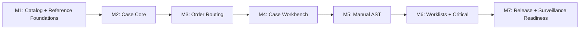

# Tasks: OGC-782 Microbiology MVP Workflow

**Input**: Design documents from
`/specs/782-ogc-782-microbiology-mvp-spec/`
**Prerequisites**: `spec.md`, `plan.md`, `research.md`, `data-model.md`,
`contracts/microbiology-openapi.yaml`, `quickstart.md`

**Tests**: Mandatory. Each milestone starts with failing tests or test plans
before implementation. Runtime Playwright evidence is required for UI milestones
and for final MVP acceptance. PR #3789 and later remediation PRs must also use the
`DIGI-UW/code-qa` skill suite for meaningful test coverage, spec-code alignment,
simplicity review, and evidence bundling.

**Organization**: M1-M7 are sequential validation blocks inside the single MVP
implementation PR #3789 and map back to the user stories in `spec.md`. Later
remediation is delivered as one coherent behavior slice per official stacked PR.

## Format: `[ID] [P?] [Milestone] Description`

- **[P]**: Can run in parallel after its milestone dependencies are satisfied.
- **[M#]**: Milestone from `plan.md`.
- Every implementation task names the intended file path.
- Complete and validate one milestone block before beginning its dependent block.
- Update PR #3789 with each block's evidence; do not create separate M1-M7 PRs.

## Milestone Dependency Graph

## Phase 1: M1 - Catalog + Reference Foundations

**Delivery PR**: #3789, on
`feat/782-ogc-782-microbiology-mvp-m7-release-surveillance-readiness`

**Goal**: Add the minimum configuration/reference foundation for routine
bacteriology routing, culture setup defaults, organism/antibiotic lookup, AST
panels, and breakpoint standards.

**Independent Test**: A configured bacteriology test can be saved with workflow
configuration, reference lookups work, migrations roll back, and no case
workflow UI is required.

### Tests First

- [X] T001 [M1] Confirm the current worktree is on PR #3789's delivery branch and that its base is `spec/782-ogc-782-microbiology-mvp-spec`.
- [X] T002 [P] [M1] Add failing JUnit 4 service tests for workflow-type validation and culture recipe lookup in `src/test/java/org/openelisglobal/microbiology/service/MicrobiologyReferenceServiceTest.java`.
- [X] T003 [P] [M1] Add failing JUnit 4 service tests for breakpoint lookup including no-breakpoint behavior in `src/test/java/org/openelisglobal/microbiology/service/MicroBreakpointServiceTest.java`.
- [X] T004 [P] [M1] Add failing DAO/integration tests for organism, antibiotic, AST panel, and breakpoint persistence in `src/test/java/org/openelisglobal/microbiology/MicrobiologyReferenceDataIntegrationTest.java`.
- [X] T005 [P] [M1] Add failing ORM validation test for new microbiology reference valueholders in `src/test/java/org/openelisglobal/microbiology/MicrobiologyOrmValidationTest.java`.
- [X] T006 [P] [M1] Add failing Test Catalog regression tests for saving and loading culture workflow configuration in `src/test/java/org/openelisglobal/testcatalog/controller/rest/TestCatalogEditorMicrobiologyTest.java`.

### Implementation

- [X] T007 [M1] Add workflow-type configuration and microbiology reference tables in `src/main/resources/liquibase/3.5.x.x/<next-available>-microbiology-reference-foundations.xml`, include it explicitly from `src/main/resources/liquibase/3.5.x.x/base.xml`, and provide rollback.
- [X] T008 [P] [M1] Add `MicroWorkflowType` enum in `src/main/java/org/openelisglobal/microbiology/valueholder/MicroWorkflowType.java`.
- [X] T009 [P] [M1] Add reference valueholders for organisms, antibiotics, AST panels, and breakpoint standards in `src/main/java/org/openelisglobal/microbiology/valueholder/`.
- [X] T010 [P] [M1] Add DAO interfaces for microbiology reference valueholders in `src/main/java/org/openelisglobal/microbiology/dao/`.
- [X] T011 [P] [M1] Add DAO implementations for microbiology reference valueholders in `src/main/java/org/openelisglobal/microbiology/daoimpl/`.
- [X] T012 [M1] Add `MicrobiologyReferenceService` and implementation in `src/main/java/org/openelisglobal/microbiology/service/MicrobiologyReferenceService.java` and `src/main/java/org/openelisglobal/microbiology/service/MicrobiologyReferenceServiceImpl.java`.
- [X] T013 [M1] Add `MicroBreakpointService` and implementation in `src/main/java/org/openelisglobal/microbiology/service/MicroBreakpointService.java` and `src/main/java/org/openelisglobal/microbiology/service/MicroBreakpointServiceImpl.java`.
- [X] T014 [M1] Extend Test Catalog DTO/load/save behavior for culture workflow configuration in `src/main/java/org/openelisglobal/testcatalog/controller/rest/TestCatalogEditorRestController.java`.
- [X] T015 [P] [M1] Add React Intl source keys for M1 admin fields in `frontend/src/languages/en.json`.
- [X] T016 [P] [M1] Add Test Catalog microbiology field rendering and validation in `frontend/src/components/admin/testCatalog/sections/BasicInfoSection.jsx`.
- [X] T017 [P] [M1] Add frontend tests for Test Catalog microbiology fields in `frontend/src/components/admin/testCatalog/sections/BasicInfoSection.test.jsx`.
- [X] T018 [M1] Run focused backend validation `mvn -q -Dtest='MicrobiologyReferenceServiceTest,MicroBreakpointServiceTest,MicrobiologyReferenceDataIntegrationTest,MicrobiologyOrmValidationTest,TestCatalogEditorMicrobiologyTest' test` from the repository root.
- [X] T019 [M1] Run focused frontend validation `cd frontend && npm test -- --runInBand BasicInfoSection.test.jsx` from the repository root.
- [X] T020 [M1] Run formatting and migration hygiene checks `mvn spotless:apply && git diff --check` from the repository root.
- [X] T021 [M1] Update PR #3789 with M1 validation evidence and mark the M1 block complete before starting M2.

## Phase 2: M2 - Case Core

**Delivery PR**: #3789

**Goal**: Add backend case identity, activity timeline, isolate lifecycle, and
case DTO compilation anchored to `SampleItem + workflow`.

**Independent Test**: A case can be created for one SampleItem/workflow, sibling
cases can coexist on the same SampleItem, and compiled case details do not rely
on lazy loading in controllers.

### Tests First

- [X] T022 [M2] Continue on PR #3789 after the M1 block is complete and validated.
- [X] T023 [P] [M2] Add failing service tests for case creation, uniqueness, and sibling lookup in `src/test/java/org/openelisglobal/microbiology/service/MicroCaseServiceTest.java`.
- [X] T024 [P] [M2] Add failing service tests for case state transitions and invalid transition rejection in `src/test/java/org/openelisglobal/microbiology/service/MicroCaseStateServiceTest.java`.
- [X] T025 [P] [M2] Add failing service tests for isolate lifecycle rules in `src/test/java/org/openelisglobal/microbiology/service/MicroIsolateServiceTest.java`.
- [X] T026 [P] [M2] Add failing DAO/integration tests for case, activity, and isolate persistence in `src/test/java/org/openelisglobal/microbiology/MicroCaseIntegrationTest.java`.
- [X] T027 [P] [M2] Add failing controller DTO compilation test that verifies case detail JSON without controller relationship traversal in `src/test/java/org/openelisglobal/microbiology/controller/MicroCaseRestControllerTest.java`.
- [X] T028 [P] [M2] Add architecture regression check for no `@Transactional` annotations in microbiology controllers in `src/test/java/org/openelisglobal/microbiology/MicrobiologyArchitectureTest.java`.

### Implementation

- [X] T029 [M2] Add case core tables and constraints in `src/main/resources/liquibase/3.5.x.x/<next-available>-microbiology-case-core.xml`, include it explicitly from `src/main/resources/liquibase/3.5.x.x/base.xml`, and provide rollback.
- [X] T030 [P] [M2] Add `MicroCase`, `MicroCaseActivity`, and `MicroIsolate` valueholders in `src/main/java/org/openelisglobal/microbiology/valueholder/`.
- [X] T031 [P] [M2] Add case, activity, and isolate DAO interfaces in `src/main/java/org/openelisglobal/microbiology/dao/`.
- [X] T032 [P] [M2] Add case, activity, and isolate DAO implementations in `src/main/java/org/openelisglobal/microbiology/daoimpl/`.
- [X] T033 [M2] Add case service contracts in `src/main/java/org/openelisglobal/microbiology/service/MicroCaseService.java`, `MicroCaseStateService.java`, and `MicroIsolateService.java`.
- [X] T034 [M2] Add case service implementations with service-layer transactions in `src/main/java/org/openelisglobal/microbiology/service/MicroCaseServiceImpl.java`, `MicroCaseStateServiceImpl.java`, and `MicroIsolateServiceImpl.java`.
- [X] T035 [M2] Add case forms/DTOs in `src/main/java/org/openelisglobal/microbiology/form/MicroCaseDetailForm.java`, `MicroCaseActivityForm.java`, and `MicroIsolateForm.java`.
- [X] T036 [M2] Add read-only case REST controller in `src/main/java/org/openelisglobal/microbiology/controller/rest/MicroCaseRestController.java`.
- [X] T037 [M2] Run focused backend validation `mvn -q -Dtest='MicroCaseServiceTest,MicroCaseStateServiceTest,MicroIsolateServiceTest,MicroCaseIntegrationTest,MicroCaseRestControllerTest,MicrobiologyArchitectureTest' test` from the repository root.
- [X] T038 [M2] Run formatting and migration hygiene checks `mvn spotless:apply && git diff --check` from the repository root.
- [X] T039 [M2] Update PR #3789 with M2 validation evidence and mark the M2 block complete before starting M3.

## Phase 3: M3 - Order Routing

**Delivery PR**: #3789

**Goal**: Create or find microbiology cases from ordered test workflow
configuration during order/sample save.

**Independent Test**: Non-micro orders create no case, bacteriology orders create
one case, and a same-specimen bacteriology/TB order creates sibling workflows
without duplicate accessioning.

### Tests First

- [X] T040 [M3] Continue on PR #3789 after the M2 block is complete and validated.
- [X] T041 [P] [M3] Add failing routing resolver unit tests in `src/test/java/org/openelisglobal/microbiology/service/MicroOrderRoutingServiceTest.java`.
- [X] T042 [P] [M3] Add failing order-save integration tests for non-micro, bacteriology, and sibling workflow cases in `src/test/java/org/openelisglobal/microbiology/MicroOrderRoutingIntegrationTest.java`.
- [X] T043 [P] [M3] Add failing idempotency integration test for repeated order saves in `src/test/java/org/openelisglobal/microbiology/MicroOrderRoutingIdempotencyTest.java`.
- [X] T044 [P] [M3] Add failing controller/contract test for case lookup by accession/sample item in `src/test/java/org/openelisglobal/microbiology/controller/MicroCaseLookupRestControllerTest.java`.

### Implementation

- [X] T045 [M3] Add routing service contract in `src/main/java/org/openelisglobal/microbiology/service/MicroOrderRoutingService.java`.
- [X] T046 [M3] Implement order routing service in `src/main/java/org/openelisglobal/microbiology/service/MicroOrderRoutingServiceImpl.java`.
- [X] T047 [M3] Wire routing from the existing order/sample save integration point in `src/main/java/org/openelisglobal/sample/service/SampleServiceImpl.java`.
- [X] T048 [M3] Add case lookup endpoint and DTO support in `src/main/java/org/openelisglobal/microbiology/controller/rest/MicroCaseRestController.java` and `src/main/java/org/openelisglobal/microbiology/form/MicroCaseLookupForm.java`.
- [X] T049 [M3] Add configuration error handling for missing culture workflow/method defaults in `src/main/java/org/openelisglobal/microbiology/service/MicroOrderRoutingServiceImpl.java`.
- [X] T050 [M3] Run focused backend validation `mvn -q -Dtest='MicroOrderRoutingServiceTest,MicroOrderRoutingIntegrationTest,MicroOrderRoutingIdempotencyTest,MicroCaseLookupRestControllerTest' test` from the repository root.
- [X] T051 [M3] Run formatting and migration hygiene checks `mvn spotless:apply && git diff --check` from the repository root.
- [X] T052 [M3] Update PR #3789 with M3 validation evidence and mark the M3 block complete before starting M4.

## Phase 4: M4 - Case Workbench

**Delivery PR**: #3789

**Goal**: Provide REST and React case workbench surfaces for setup,
incubation/growth/no-growth/rejection events, isolate creation/update, and case
history.

**Independent Test**: A routed bacteriology case can be opened, setup can be
recorded, growth can be logged, an isolate can be created, and the visible
timeline updates.

### Tests First

- [ ] T053 [M4] Continue on PR #3789 after the M3 block is complete and validated.
- [ ] T054 [P] [M4] Run `/plan-record-playwright --flows microbiology-case-workbench` and record the planned route, setup data, assertions, and project target in `specs/782-ogc-782-microbiology-mvp-spec/playwright-plan.md`.
- [ ] T055 [P] [M4] Add failing MockMvc tests for activity creation and isolate creation in `src/test/java/org/openelisglobal/microbiology/controller/MicroCaseRestControllerTest.java`.
- [ ] T056 [P] [M4] Add failing React interaction tests for case detail loading and setup event save in `frontend/src/components/microbiology/__tests__/MicrobiologyCaseView.test.jsx`.
- [ ] T057 [P] [M4] Add failing React interaction tests for isolate creation/update in `frontend/src/components/microbiology/__tests__/IsolatePanel.test.jsx`.
- [ ] T058 [P] [M4] Use `/write-playwright-test frontend/playwright/tests/foundational/core/microbiology-case-workbench.spec.ts --project core-app` to create a red Playwright test for routed case setup and isolate creation.

### Implementation

- [ ] T059 [M4] Add activity mutation endpoints in `src/main/java/org/openelisglobal/microbiology/controller/rest/MicroCaseRestController.java`.
- [ ] T060 [M4] Add isolate mutation endpoints in `src/main/java/org/openelisglobal/microbiology/controller/rest/MicroIsolateRestController.java`.
- [ ] T061 [P] [M4] Add frontend API client functions in `frontend/src/components/microbiology/MicrobiologyService.js`.
- [ ] T062 [P] [M4] Add case page route in `frontend/src/pages/MicrobiologyPage.jsx` and `frontend/src/App.jsx`.
- [ ] T063 [M4] Add case view shell and context header in `frontend/src/components/microbiology/MicrobiologyCaseView.jsx`.
- [ ] T064 [M4] Add timeline and setup activity panel in `frontend/src/components/microbiology/CaseTimelinePanel.jsx`.
- [ ] T065 [M4] Add isolate panel in `frontend/src/components/microbiology/IsolatePanel.jsx`.
- [ ] T066 [P] [M4] Add React Intl keys for case workbench UI in `frontend/src/languages/en.json`.
- [ ] T067 [M4] Register `frontend/playwright/tests/foundational/core/microbiology-case-workbench.spec.ts` in `frontend/playwright.config.ts`.
- [ ] T068 [M4] Run Playwright registration validation `python3 .ai/skills/playwright/scripts/validate-playwright-project.py frontend/playwright/tests/foundational/core/microbiology-case-workbench.spec.ts` from the repository root.
- [ ] T069 [M4] Run `/audit-playwright frontend/playwright/tests/foundational/core/microbiology-case-workbench.spec.ts` and address findings in `frontend/playwright/tests/foundational/core/microbiology-case-workbench.spec.ts`.
- [ ] T070 [M4] Run narrow Playwright evidence command `cd frontend && npm run pw:test -- playwright/tests/foundational/core/microbiology-case-workbench.spec.ts --project=core-app` and attach screenshot/trace results to the PR.
- [ ] T071 [M4] Run focused backend/frontend validation `mvn -q -Dtest='MicroCaseRestControllerTest' test && cd frontend && npm test -- --runInBand MicrobiologyCaseView.test.jsx IsolatePanel.test.jsx` from the repository root.
- [ ] T072 [M4] Update PR #3789 with M4 TDD and Playwright evidence and mark the M4 block complete before starting M5.

## Phase 5: M5 - Manual AST

**Delivery PR**: #3789

**Goal**: Add manual AST setup, readings, S/I/R interpretation, no-breakpoint
handling, repeat/retest, review, and override audit.

**Independent Test**: An identified significant isolate supports AST entry,
interpretation, review, override with reason, and final-release blocking while
unreviewed.

### Tests First

- [ ] T073 [M5] Continue on PR #3789 after the M4 block is complete and validated.
- [ ] T074 [P] [M5] Add failing AST interpretation unit tests for MIC, zone, no-breakpoint, and override behavior in `src/test/java/org/openelisglobal/microbiology/service/MicroAstInterpretationServiceTest.java`.
- [ ] T075 [P] [M5] Add failing AST persistence integration tests for runs, readings, repeat/retest, and review state in `src/test/java/org/openelisglobal/microbiology/MicroAstIntegrationTest.java`.
- [ ] T076 [P] [M5] Add failing readiness service tests proving unreviewed AST blocks final release in `src/test/java/org/openelisglobal/microbiology/service/MicroCaseReadinessServiceTest.java`.
- [ ] T077 [P] [M5] Add failing React interaction tests for AST entry, interpretation display, and override reason validation in `frontend/src/components/microbiology/__tests__/AstEntryPanel.test.jsx`.
- [ ] T078 [P] [M5] Use `/write-playwright-test frontend/playwright/tests/foundational/core/microbiology-manual-ast.spec.ts --project core-app` to create a red Playwright test for manual AST entry and override audit.

### Implementation

- [ ] T079 [M5] Add AST tables in `src/main/resources/liquibase/3.5.x.x/<next-available>-microbiology-manual-ast.xml`, include it explicitly from `src/main/resources/liquibase/3.5.x.x/base.xml`, and provide rollback.
- [ ] T080 [P] [M5] Add AST valueholders in `src/main/java/org/openelisglobal/microbiology/valueholder/MicroAstRun.java` and `src/main/java/org/openelisglobal/microbiology/valueholder/MicroAstReading.java`.
- [ ] T081 [P] [M5] Add AST DAO interfaces and implementations in `src/main/java/org/openelisglobal/microbiology/dao/` and `src/main/java/org/openelisglobal/microbiology/daoimpl/`.
- [ ] T082 [M5] Add AST service contracts in `src/main/java/org/openelisglobal/microbiology/service/MicroAstService.java` and `src/main/java/org/openelisglobal/microbiology/service/MicroAstInterpretationService.java`.
- [ ] T083 [M5] Implement AST services in `src/main/java/org/openelisglobal/microbiology/service/MicroAstServiceImpl.java` and `src/main/java/org/openelisglobal/microbiology/service/MicroAstInterpretationServiceImpl.java`.
- [ ] T084 [M5] Add AST REST controller and forms in `src/main/java/org/openelisglobal/microbiology/controller/rest/MicroAstRestController.java` and `src/main/java/org/openelisglobal/microbiology/form/`.
- [ ] T085 [M5] Add readiness service contract and implementation in `src/main/java/org/openelisglobal/microbiology/service/MicroCaseReadinessService.java` and `src/main/java/org/openelisglobal/microbiology/service/MicroCaseReadinessServiceImpl.java`.
- [ ] T086 [M5] Add AST entry panel in `frontend/src/components/microbiology/AstEntryPanel.jsx`.
- [ ] T087 [P] [M5] Add React Intl keys for AST UI in `frontend/src/languages/en.json`.
- [ ] T088 [M5] Register `frontend/playwright/tests/foundational/core/microbiology-manual-ast.spec.ts` in `frontend/playwright.config.ts`.
- [ ] T089 [M5] Run Playwright registration validation `python3 .ai/skills/playwright/scripts/validate-playwright-project.py frontend/playwright/tests/foundational/core/microbiology-manual-ast.spec.ts` from the repository root.
- [ ] T090 [M5] Run `/audit-playwright frontend/playwright/tests/foundational/core/microbiology-manual-ast.spec.ts` and address findings in `frontend/playwright/tests/foundational/core/microbiology-manual-ast.spec.ts`.
- [ ] T091 [M5] Run narrow Playwright evidence command `cd frontend && npm run pw:test -- playwright/tests/foundational/core/microbiology-manual-ast.spec.ts --project=core-app` and attach screenshot/trace results to the PR.
- [ ] T092 [M5] Run focused backend/frontend validation `mvn -q -Dtest='MicroAstInterpretationServiceTest,MicroAstIntegrationTest,MicroCaseReadinessServiceTest' test && cd frontend && npm test -- --runInBand AstEntryPanel.test.jsx` from the repository root.
- [ ] T093 [M5] Update PR #3789 with M5 TDD and Playwright evidence and mark the M5 block complete before starting M6.

## Phase 6: M6 - Worklists + Critical Communications

**Delivery PR**: #3789

**Goal**: Add shared worklist filtering/prioritization, sibling visibility,
critical communication logging, and existing Alert dashboard surfacing.

**Independent Test**: Users can find due microbiology work, see sibling
workflows, and log a critical communication without needing complete provider
directory data.

### Tests First

- [ ] T094 [M6] Continue on PR #3789 after the M5 block is complete and validated.
- [ ] T095 [P] [M6] Add failing worklist service tests for due-action sorting, urgency, sibling visibility, and review flags in `src/test/java/org/openelisglobal/microbiology/service/MicroWorklistServiceTest.java`.
- [ ] T096 [P] [M6] Add failing worklist integration test with at least 200 seeded in-flight cases in `src/test/java/org/openelisglobal/microbiology/MicroWorklistIntegrationTest.java`.
- [ ] T097 [P] [M6] Add failing critical communication service tests for recipient free text, ack state, follow-up, and immutable correction behavior in `src/test/java/org/openelisglobal/microbiology/service/MicroCriticalCommunicationServiceTest.java`.
- [ ] T098 [P] [M6] Add failing Alert integration tests for microbiology critical alert creation and filtering in `src/test/java/org/openelisglobal/microbiology/MicroCriticalAlertIntegrationTest.java`.
- [ ] T099 [P] [M6] Add failing React interaction tests for worklist filters and critical communication logging in `frontend/src/components/microbiology/__tests__/MicrobiologyWorklist.test.jsx` and `frontend/src/components/microbiology/__tests__/CriticalCommunicationPanel.test.jsx`.
- [ ] T100 [P] [M6] Use `/write-playwright-test frontend/playwright/tests/foundational/core/microbiology-worklist-critical.spec.ts --project core-app` to create a red Playwright test for worklist navigation and critical communication logging.

### Implementation

- [ ] T101 [M6] Add the critical communication table and alert type migration in `src/main/resources/liquibase/3.5.x.x/<next-available>-microbiology-worklists-critical.xml`, include it explicitly from `src/main/resources/liquibase/3.5.x.x/base.xml`, and provide rollback.
- [ ] T102 [P] [M6] Add critical communication valueholder in `src/main/java/org/openelisglobal/microbiology/valueholder/MicroCriticalCommunication.java`.
- [ ] T103 [P] [M6] Add critical communication DAO interface and implementation in `src/main/java/org/openelisglobal/microbiology/dao/MicroCriticalCommunicationDAO.java` and `src/main/java/org/openelisglobal/microbiology/daoimpl/MicroCriticalCommunicationDAOImpl.java`.
- [ ] T104 [M6] Add worklist service in `src/main/java/org/openelisglobal/microbiology/service/MicroWorklistService.java` and `src/main/java/org/openelisglobal/microbiology/service/MicroWorklistServiceImpl.java`.
- [ ] T105 [M6] Add critical communication service in `src/main/java/org/openelisglobal/microbiology/service/MicroCriticalCommunicationService.java` and `src/main/java/org/openelisglobal/microbiology/service/MicroCriticalCommunicationServiceImpl.java`.
- [ ] T106 [M6] Add worklist and critical communication REST endpoints in `src/main/java/org/openelisglobal/microbiology/controller/rest/MicroWorklistRestController.java` and `src/main/java/org/openelisglobal/microbiology/controller/rest/MicroCriticalCommunicationRestController.java`.
- [ ] T107 [M6] Add microbiology alert enum support in `src/main/java/org/openelisglobal/alert/valueholder/AlertType.java`.
- [ ] T108 [P] [M6] Add worklist UI in `frontend/src/components/microbiology/MicrobiologyWorklist.jsx`.
- [ ] T109 [P] [M6] Add critical communication UI in `frontend/src/components/microbiology/CriticalCommunicationPanel.jsx`.
- [ ] T110 [P] [M6] Add React Intl keys for worklist and critical communication UI in `frontend/src/languages/en.json`.
- [ ] T111 [M6] Register `frontend/playwright/tests/foundational/core/microbiology-worklist-critical.spec.ts` in `frontend/playwright.config.ts`.
- [ ] T112 [M6] Run Playwright registration validation `python3 .ai/skills/playwright/scripts/validate-playwright-project.py frontend/playwright/tests/foundational/core/microbiology-worklist-critical.spec.ts` from the repository root.
- [ ] T113 [M6] Run `/audit-playwright frontend/playwright/tests/foundational/core/microbiology-worklist-critical.spec.ts` and address findings in `frontend/playwright/tests/foundational/core/microbiology-worklist-critical.spec.ts`.
- [ ] T114 [M6] Run narrow Playwright evidence command `cd frontend && npm run pw:test -- playwright/tests/foundational/core/microbiology-worklist-critical.spec.ts --project=core-app` and attach screenshot/trace results to the PR.
- [ ] T115 [M6] Run focused backend/frontend validation `mvn -q -Dtest='MicroWorklistServiceTest,MicroWorklistIntegrationTest,MicroCriticalCommunicationServiceTest,MicroCriticalAlertIntegrationTest' test && cd frontend && npm test -- --runInBand MicrobiologyWorklist.test.jsx CriticalCommunicationPanel.test.jsx` from the repository root.
- [ ] T116 [M6] Update PR #3789 with M6 TDD and Playwright evidence and mark the M6 block complete before starting M7.

## Phase 7: M7 - Release + Surveillance Readiness

**Delivery PR**: #3789

**Goal**: Add preliminary/final release readiness gates, report release handoff,
amendment-safe history, WHONET readiness extension, and final MVP Playwright
evidence.

**Independent Test**: A complete MVP bacteriology case can go from order-routed
case to setup, isolate, manual AST, review, preliminary/final readiness, and
WHONET readiness; incomplete cases show blockers.

### Tests First

- [ ] T117 [M7] Continue on PR #3789 after the M6 block is complete and validated.
- [ ] T118 [P] [M7] Add failing release service tests for preliminary release, final release blockers, and release history in `src/test/java/org/openelisglobal/microbiology/service/MicroReportReleaseServiceTest.java`.
- [ ] T119 [P] [M7] Add failing WHONET readiness tests for missing organism, antibiotic, specimen, and breakpoint mappings in `src/test/java/org/openelisglobal/microbiology/service/MicroWhonetReadinessServiceTest.java`.
- [ ] T120 [P] [M7] Add failing integration tests for final release handoff to existing result/reporting infrastructure in `src/test/java/org/openelisglobal/microbiology/MicroReportReleaseIntegrationTest.java`.
- [ ] T121 [P] [M7] Add failing React interaction tests for readiness blockers and release actions in `frontend/src/components/microbiology/__tests__/ReportReadinessPanel.test.jsx`.
- [ ] T122 [P] [M7] Run `/plan-record-playwright --flows microbiology-mvp-happy-path,microbiology-mvp-blocked-release --record` and update `specs/782-ogc-782-microbiology-mvp-spec/playwright-plan.md`.
- [ ] T123 [P] [M7] Use `/write-playwright-test frontend/playwright/tests/foundational/core/microbiology-mvp-release-readiness.spec.ts --project core-app` to create a red Playwright test for final release gating and WHONET readiness.
- [ ] T124 [P] [M7] Use `/write-playwright-test frontend/playwright/tests/demo/core/microbiology-mvp-demo.spec.ts --project core-demo` to create a red UI-only demo proof of the completed MVP happy path.

### Implementation

- [ ] T125 [M7] Add release/readiness tables or columns in `src/main/resources/liquibase/3.5.x.x/<next-available>-microbiology-release-readiness.xml`, include it explicitly from `src/main/resources/liquibase/3.5.x.x/base.xml`, and provide rollback.
- [ ] T126 [M7] Add report release service in `src/main/java/org/openelisglobal/microbiology/service/MicroReportReleaseService.java` and `src/main/java/org/openelisglobal/microbiology/service/MicroReportReleaseServiceImpl.java`.
- [ ] T127 [M7] Add WHONET readiness service in `src/main/java/org/openelisglobal/microbiology/service/MicroWhonetReadinessService.java` and `src/main/java/org/openelisglobal/microbiology/service/MicroWhonetReadinessServiceImpl.java`.
- [ ] T128 [M7] Extend existing WHONET report service through `src/main/java/org/openelisglobal/reports/service/WHONetReportServiceImpl.java` without creating a parallel exporter.
- [ ] T129 [M7] Add release and readiness REST endpoints in `src/main/java/org/openelisglobal/microbiology/controller/rest/MicroReportReleaseRestController.java` and `src/main/java/org/openelisglobal/microbiology/controller/rest/MicroWhonetReadinessRestController.java`.
- [ ] T130 [M7] Add report readiness panel in `frontend/src/components/microbiology/ReportReadinessPanel.jsx`.
- [ ] T131 [P] [M7] Add WHONET readiness UI in `frontend/src/components/microbiology/WhonetReadinessPanel.jsx`.
- [ ] T132 [P] [M7] Add React Intl keys for release and WHONET readiness UI in `frontend/src/languages/en.json`.
- [ ] T133 [M7] Register `frontend/playwright/tests/foundational/core/microbiology-mvp-release-readiness.spec.ts` and `frontend/playwright/tests/demo/core/microbiology-mvp-demo.spec.ts` in `frontend/playwright.config.ts`.
- [ ] T134 [M7] Run Playwright registration validation for both M7 specs with `python3 .ai/skills/playwright/scripts/validate-playwright-project.py frontend/playwright/tests/foundational/core/microbiology-mvp-release-readiness.spec.ts frontend/playwright/tests/demo/core/microbiology-mvp-demo.spec.ts` from the repository root.
- [ ] T135 [M7] Run `/audit-playwright frontend/playwright/tests/foundational/core/microbiology-mvp-release-readiness.spec.ts frontend/playwright/tests/demo/core/microbiology-mvp-demo.spec.ts` and address findings.
- [ ] T136 [M7] Run narrow functional Playwright evidence command `cd frontend && npm run pw:test -- playwright/tests/foundational/core/microbiology-mvp-release-readiness.spec.ts --project=core-app` and attach screenshot/trace results to the PR.
- [ ] T137 [M7] Run demo Playwright evidence command `cd frontend && npm run pw:test -- playwright/tests/demo/core/microbiology-mvp-demo.spec.ts --project=core-demo` and attach screenshot/trace results to the PR.
- [ ] T138 [M7] Run video evidence command `cd frontend && PLAYWRIGHT_VIDEO=on npm run pw:test -- playwright/tests/demo/core/microbiology-mvp-demo.spec.ts --project=core-demo-video` and verify `frontend/test-results/*/video.webm` exists.
- [ ] T139 [M7] If any Playwright run fails, run `/debug-playwright` with screenshot/trace evidence and fix either source or test in `frontend/playwright/tests/` and affected `frontend/src/components/microbiology/` files.
- [ ] T140 [M7] Run focused backend/frontend validation `mvn -q -Dtest='MicroReportReleaseServiceTest,MicroWhonetReadinessServiceTest,MicroReportReleaseIntegrationTest' test && cd frontend && npm test -- --runInBand ReportReadinessPanel.test.jsx` from the repository root.
- [ ] T141 [M7] Run final documentation consistency update in `specs/782-ogc-782-microbiology-mvp-spec/quickstart.md` and `specs/782-ogc-782-microbiology-mvp-spec/plan.md`.
- [ ] T142 [M7] Update PR #3789 with M7 TDD, Playwright trace/screenshot, and demo video evidence, then mark the M7 block complete.

## Final MVP Acceptance Gate

**Purpose**: Prove the full implemented MVP behaves as specified after M7.

- [ ] T143 [MVP] Run the complete focused backend suite `mvn -q -Dtest='Micro*Test,*Micro*IntegrationTest' test` from the repository root.
- [ ] T144 [MVP] Run the complete focused frontend suite `cd frontend && npm test -- --runInBand Microbiology` from the repository root.
- [ ] T145 [MVP] Validate all microbiology Playwright specs with `python3 .ai/skills/playwright/scripts/validate-playwright-project.py frontend/playwright/tests/foundational/core/microbiology-case-workbench.spec.ts frontend/playwright/tests/foundational/core/microbiology-manual-ast.spec.ts frontend/playwright/tests/foundational/core/microbiology-worklist-critical.spec.ts frontend/playwright/tests/foundational/core/microbiology-mvp-release-readiness.spec.ts frontend/playwright/tests/demo/core/microbiology-mvp-demo.spec.ts`.
- [ ] T146 [MVP] Run all microbiology foundational Playwright evidence with `cd frontend && npm run pw:test -- playwright/tests/foundational/core/microbiology-*.spec.ts --project=core-app`.
- [ ] T147 [MVP] Run all microbiology demo Playwright evidence with `cd frontend && npm run pw:test -- playwright/tests/demo/core/microbiology-mvp-demo.spec.ts --project=core-demo`.
- [ ] T148 [MVP] Record final MVP video evidence with `cd frontend && PLAYWRIGHT_VIDEO=on npm run pw:test -- playwright/tests/demo/core/microbiology-mvp-demo.spec.ts --project=core-demo-video`.
- [ ] T149 [MVP] Attach or link final Playwright screenshots, traces for failures if any, and `video.webm` evidence in PR #3789 and parent spec PR #3782.
- [ ] T150 [MVP] Run `mvn spotless:apply && cd frontend && npm run format` from the repository root.
- [ ] T151 [MVP] Run `git diff --check` from the repository root.
- [ ] T152 [MVP] Initialize the repository-pinned `tools/code-qa` submodule and verify its reviewed revision before final MVP acceptance.
- [ ] T153 [MVP] Run the `meaningful-test-coverage` workflow from `DIGI-UW/code-qa` against the implemented microbiology MVP and record which backend, frontend, and E2E tests satisfy the inversion test in PR #3789.
- [ ] T154 [MVP] Run the `spec-code-alignment` workflow from `DIGI-UW/code-qa` against `specs/782-ogc-782-microbiology-mvp-spec/` and the implemented code, then update lagging specs or file defects for real code divergence.
- [ ] T155 [MVP] Run the `simplicity-review` workflow from `DIGI-UW/code-qa` against the MVP diff and remove or explicitly justify speculative abstractions, duplicate exporters, duplicate alert surfaces, or unused configuration.
- [ ] T156 [MVP] Run the `evidence-bundle` workflow from `DIGI-UW/code-qa` after the final `core-demo-video` Playwright run and attach the generated text report plus manually shared media links to PR #3789 and parent spec PR #3782.

## Dependencies & Execution Order

- M1 blocks all later milestones.
- M2 depends on M1 because case identity needs workflow/reference config.
- M3 depends on M2 because routing creates cases.
- M4 depends on M3 because the workbench opens routed cases.
- M5 depends on M4 because AST belongs to identified isolates.
- M6 depends on M5 because worklist urgency and review flags include AST state.
- M7 depends on M6 because release/readiness includes critical communication and
  worklist-visible blockers.
- Final MVP acceptance depends on M7.

## Parallel Opportunities

- M1 reference valueholders, DAOs, and frontend Test Catalog field tests can be
  split after the Liquibase design is agreed.
- M2 service tests for case state, isolate lifecycle, and DTO compilation can be
  written in parallel.
- M4 React panels can be split between case header, timeline, and isolate work
  once REST contracts are stable.
- M5 AST backend interpretation tests and frontend AST entry tests can proceed
  in parallel after the M5 contract is fixed.
- M6 worklist and critical communication UI can proceed in parallel after the
  shared service DTOs are fixed.
- M7 WHONET readiness and report readiness panels can proceed in parallel after
  release blockers are defined.

## TDD Rules

- Write the listed tests first and verify they fail for the expected reason.
- Do not mark a milestone block complete until its focused test command passes.
- Do not stub the backend mutation under test in Playwright evidence.
- Do not use raw `npx playwright test`; use `npm run pw:test`.
- Do not add new Cypress tests.
- Every Playwright test must pass registration validation, `/audit-playwright`,
  and at least one narrow `core-app` or `core-demo` run before PR review.
- Use `/debug-playwright` with screenshot/trace evidence before changing a
  failing Playwright selector or assertion.
- Use `DIGI-UW/code-qa` before final review: `meaningful-test-coverage` must
  reject theater tests, `spec-code-alignment` must reconcile implemented code
  with `spec.md`/`plan.md`/`tasks.md`, `simplicity-review` must catch bloat, and
  `evidence-bundle` must package final Playwright proof without committing
  binary media.
