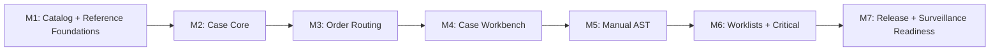

# Tasks: OGC-782 Microbiology MVP Workflow

**Input**: Design documents from
`/specs/782-ogc-782-microbiology-mvp-spec/`
**Prerequisites**: `spec.md`, `plan.md`, `research.md`, `data-model.md`,
`contracts/microbiology-openapi.yaml`, `quickstart.md`

**Tests**: Mandatory. Each milestone starts with failing tests or test plans
before implementation. Runtime Playwright evidence is required for UI milestones
and final MVP acceptance. Each implementation stack layer must also use the
`DIGI-UW/code-qa` skill suite for meaningful test coverage, spec-code alignment,
simplicity review, and evidence bundling.

**Organization**: M1-M7 are sequential validation blocks grouped into four
native stack layers: M1-M3, M4-M5, M6, and M7 plus MVP closure. Later remediation
is delivered as one coherent behavior slice per stacked PR.

## Format: `[ID] [P?] [Milestone] Description`

- **[P]**: Can run in parallel after its milestone dependencies are satisfied.
- **[M#]**: Milestone from `plan.md`.
- Every implementation task names the intended file path.
- Complete and validate one milestone block before beginning its dependent block.
- Update the stack layer that owns each block; do not create one PR per internal
  milestone.

## Milestone Dependency Graph

## Phase 1: M1 - Catalog + Reference Foundations

**Delivery PR**: #3789, on
`feat/782-ogc-782-microbiology-mvp-m7-release-surveillance-readiness`

**Goal**: Add the minimum configuration/reference foundation for routine
bacteriology routing, culture setup defaults, organism/antibiotic lookup, AST
panels, and breakpoint standards.

**Independent Test**: A configured bacteriology test can be saved with workflow
configuration, reference lookups work, migrations roll back, and no case
workflow UI is required.

### Tests First

- [X] T001 [M1] Confirm the current worktree is on PR #3789's delivery branch and that its base is `spec/782-ogc-782-microbiology-mvp-spec`.
- [X] T002 [P] [M1] Add failing JUnit 4 service tests for workflow-type validation and culture recipe lookup in `src/test/java/org/openelisglobal/microbiology/service/MicrobiologyReferenceServiceTest.java`.
- [X] T003 [P] [M1] Add failing JUnit 4 service tests for breakpoint lookup including no-breakpoint behavior in `src/test/java/org/openelisglobal/microbiology/service/MicroBreakpointServiceTest.java`.
- [X] T004 [P] [M1] Add failing DAO/integration tests for organism, antibiotic, AST panel, and breakpoint persistence in `src/test/java/org/openelisglobal/microbiology/MicrobiologyReferenceDataIntegrationTest.java`.
- [X] T005 [P] [M1] Add failing ORM validation test for new microbiology reference valueholders in `src/test/java/org/openelisglobal/microbiology/MicrobiologyOrmValidationTest.java`.
- [X] T006 [P] [M1] Add failing Test Catalog regression tests for saving and loading culture workflow configuration in `src/test/java/org/openelisglobal/testcatalog/controller/rest/TestCatalogEditorMicrobiologyTest.java`.

### Implementation

- [X] T007 [M1] Add workflow-type configuration and microbiology reference tables in `src/main/resources/liquibase/3.5.x.x/<next-available>-microbiology-reference-foundations.xml`, include it explicitly from `src/main/resources/liquibase/3.5.x.x/base.xml`, and provide rollback.
- [X] T008 [P] [M1] Add `MicroWorkflowType` enum in `src/main/java/org/openelisglobal/microbiology/valueholder/MicroWorkflowType.java`.
- [X] T009 [P] [M1] Add reference valueholders for organisms, antibiotics, AST panels, and breakpoint standards in `src/main/java/org/openelisglobal/microbiology/valueholder/`.
- [X] T010 [P] [M1] Add DAO interfaces for microbiology reference valueholders in `src/main/java/org/openelisglobal/microbiology/dao/`.
- [X] T011 [P] [M1] Add DAO implementations for microbiology reference valueholders in `src/main/java/org/openelisglobal/microbiology/daoimpl/`.
- [X] T012 [M1] Add `MicrobiologyReferenceService` and implementation in `src/main/java/org/openelisglobal/microbiology/service/MicrobiologyReferenceService.java` and `src/main/java/org/openelisglobal/microbiology/service/MicrobiologyReferenceServiceImpl.java`.
- [X] T013 [M1] Add `MicroBreakpointService` and implementation in `src/main/java/org/openelisglobal/microbiology/service/MicroBreakpointService.java` and `src/main/java/org/openelisglobal/microbiology/service/MicroBreakpointServiceImpl.java`.
- [X] T014 [M1] Extend Test Catalog DTO/load/save behavior for culture workflow configuration in `src/main/java/org/openelisglobal/testcatalog/controller/rest/TestCatalogEditorRestController.java`.
- [X] T015 [P] [M1] Add React Intl source keys for M1 admin fields in `frontend/src/languages/en.json`.
- [X] T016 [P] [M1] Add Test Catalog microbiology field rendering and validation in `frontend/src/components/admin/testCatalog/sections/BasicInfoSection.jsx`.
- [X] T017 [P] [M1] Add frontend tests for Test Catalog microbiology fields in `frontend/src/components/admin/testCatalog/sections/BasicInfoSection.test.jsx`.
- [X] T018 [M1] Run focused backend validation `mvn -q -Dtest='MicrobiologyReferenceServiceTest,MicroBreakpointServiceTest,MicrobiologyReferenceDataIntegrationTest,MicrobiologyOrmValidationTest,TestCatalogEditorMicrobiologyTest' test` from the repository root.
- [X] T019 [M1] Run focused frontend validation `cd frontend && npm test -- --runInBand BasicInfoSection.test.jsx` from the repository root.
- [X] T020 [M1] Run formatting and migration hygiene checks `mvn spotless:apply && git diff --check` from the repository root.
- [X] T021 [M1] Update the foundations/order layer with M1 validation evidence and mark the block complete before starting M2.

## Phase 2: M2 - Case Core

**Delivery PR**: foundations and order routing (#3789)

**Goal**: Add backend case identity, activity timeline, isolate lifecycle, and
case DTO compilation anchored to `SampleItem + workflow`.

**Independent Test**: A case can be created for one SampleItem/workflow, sibling
cases can coexist on the same SampleItem, and compiled case details do not rely
on lazy loading in controllers.

### Tests First

- [X] T022 [M2] Continue on the foundations/order layer after M1 is complete and validated.
- [X] T023 [P] [M2] Add failing service tests for case creation, uniqueness, and sibling lookup in `src/test/java/org/openelisglobal/microbiology/service/MicroCaseServiceTest.java`.
- [X] T024 [P] [M2] Add failing service tests for case state transitions and invalid transition rejection in `src/test/java/org/openelisglobal/microbiology/service/MicroCaseStateServiceTest.java`.
- [X] T025 [P] [M2] Add failing service tests for isolate lifecycle rules in `src/test/java/org/openelisglobal/microbiology/service/MicroIsolateServiceTest.java`.
- [X] T026 [P] [M2] Add failing DAO/integration tests for case, activity, and isolate persistence in `src/test/java/org/openelisglobal/microbiology/MicroCaseIntegrationTest.java`.
- [X] T027 [P] [M2] Add failing controller DTO compilation test that verifies case detail JSON without controller relationship traversal in `src/test/java/org/openelisglobal/microbiology/controller/MicroCaseRestControllerTest.java`.
- [X] T028 [P] [M2] Add architecture regression check for no `@Transactional` annotations in microbiology controllers in `src/test/java/org/openelisglobal/microbiology/MicrobiologyArchitectureTest.java`.

### Implementation

- [X] T029 [M2] Add case core tables and constraints in `src/main/resources/liquibase/3.5.x.x/<next-available>-microbiology-case-core.xml`, include it explicitly from `src/main/resources/liquibase/3.5.x.x/base.xml`, and provide rollback.
- [X] T030 [P] [M2] Add `MicroCase`, `MicroCaseActivity`, and `MicroIsolate` valueholders in `src/main/java/org/openelisglobal/microbiology/valueholder/`.
- [X] T031 [P] [M2] Add case, activity, and isolate DAO interfaces in `src/main/java/org/openelisglobal/microbiology/dao/`.
- [X] T032 [P] [M2] Add case, activity, and isolate DAO implementations in `src/main/java/org/openelisglobal/microbiology/daoimpl/`.
- [X] T033 [M2] Add case service contracts in `src/main/java/org/openelisglobal/microbiology/service/MicroCaseService.java`, `MicroCaseStateService.java`, and `MicroIsolateService.java`.
- [X] T034 [M2] Add case service implementations with service-layer transactions in `src/main/java/org/openelisglobal/microbiology/service/MicroCaseServiceImpl.java`, `MicroCaseStateServiceImpl.java`, and `MicroIsolateServiceImpl.java`.
- [X] T035 [M2] Add case forms/DTOs in `src/main/java/org/openelisglobal/microbiology/form/MicroCaseDetailForm.java`, `MicroCaseActivityForm.java`, and `MicroIsolateForm.java`.
- [X] T036 [M2] Add read-only case REST controller in `src/main/java/org/openelisglobal/microbiology/controller/rest/MicroCaseRestController.java`.
- [X] T037 [M2] Run focused backend validation `mvn -q -Dtest='MicroCaseServiceTest,MicroCaseStateServiceTest,MicroIsolateServiceTest,MicroCaseIntegrationTest,MicroCaseRestControllerTest,MicrobiologyArchitectureTest' test` from the repository root.
- [X] T038 [M2] Run formatting and migration hygiene checks `mvn spotless:apply && git diff --check` from the repository root.
- [X] T039 [M2] Update the foundations/order layer with M2 validation evidence and mark the block complete before starting M3.

## Phase 3: M3 - Order Routing

**Delivery PR**: foundations and order routing (#3789)

**Goal**: Create or find microbiology cases from ordered test workflow
configuration during order/sample save.

**Independent Test**: Non-micro orders create no case, bacteriology orders create
one case, and a same-specimen bacteriology/TB order creates sibling workflows
without duplicate accessioning.

### Tests First

- [X] T040 [M3] Continue on the foundations/order layer after M2 is complete and validated.
- [X] T041 [P] [M3] Add failing routing resolver unit tests in `src/test/java/org/openelisglobal/microbiology/service/MicroOrderRoutingServiceTest.java`.
- [X] T042 [P] [M3] Add failing order-save integration tests for non-micro, bacteriology, and sibling workflow cases in `src/test/java/org/openelisglobal/microbiology/MicroOrderRoutingIntegrationTest.java`.
- [X] T043 [P] [M3] Add failing idempotency integration test for repeated order saves in `src/test/java/org/openelisglobal/microbiology/MicroOrderRoutingIdempotencyTest.java`.
- [X] T044 [P] [M3] Add failing controller/contract test for case lookup by accession/sample item in `src/test/java/org/openelisglobal/microbiology/controller/MicroCaseLookupRestControllerTest.java`.

### Implementation

- [X] T045 [M3] Add routing service contract in `src/main/java/org/openelisglobal/microbiology/service/MicroOrderRoutingService.java`.
- [X] T046 [M3] Implement order routing service in `src/main/java/org/openelisglobal/microbiology/service/MicroOrderRoutingServiceImpl.java`.
- [X] T047 [M3] Wire routing from the existing order/sample save integration point in `src/main/java/org/openelisglobal/sample/service/SampleServiceImpl.java`.
- [X] T048 [M3] Add case lookup endpoint and DTO support in `src/main/java/org/openelisglobal/microbiology/controller/rest/MicroCaseRestController.java` and `src/main/java/org/openelisglobal/microbiology/form/MicroCaseLookupForm.java`.
- [X] T049 [M3] Add configuration error handling for missing culture workflow/method defaults in `src/main/java/org/openelisglobal/microbiology/service/MicroOrderRoutingServiceImpl.java`.
- [X] T050 [M3] Run focused backend validation `mvn -q -Dtest='MicroOrderRoutingServiceTest,MicroOrderRoutingIntegrationTest,MicroOrderRoutingIdempotencyTest,MicroCaseLookupRestControllerTest' test` from the repository root.
- [X] T051 [M3] Run formatting and migration hygiene checks `mvn spotless:apply && git diff --check` from the repository root.
- [X] T052 [M3] Complete the foundations/order layer and begin the workbench/AST layer only after focused validation passes.

## Phase 4: M4 - Case Workbench

**Delivery PR**: `feat/782-ogc-782-microbiology-mvp-workbench-ast`

**Goal**: Provide REST and React case workbench surfaces for setup,
incubation/growth/no-growth/rejection events, isolate creation/update, and case
history.

**Independent Test**: A routed bacteriology case can be opened, setup can be
recorded, growth can be logged, an isolate can be created, and the visible
timeline updates.

### Tests First

- [X] T053 [M4] Start the workbench/AST layer after M3 is complete and validated.
- [X] T054 [P] [M4] Run `/plan-record-playwright --flows microbiology-case-workbench` and record the planned route, setup data, assertions, and project target in `specs/782-ogc-782-microbiology-mvp-spec/playwright-plan.md`.
- [X] T055 [P] [M4] Add failing MockMvc tests for activity creation and isolate creation in `src/test/java/org/openelisglobal/microbiology/controller/MicroCaseRestControllerTest.java`.
- [X] T056 [P] [M4] Add failing React interaction tests for case detail loading and setup event save in `frontend/src/components/microbiology/__tests__/MicrobiologyCaseView.test.jsx`.
- [X] T057 [P] [M4] Add failing React interaction tests for isolate creation/update in `frontend/src/components/microbiology/__tests__/IsolatePanel.test.jsx`.
- [X] T058 [P] [M4] Use `/write-playwright-test frontend/playwright/tests/foundational/core/microbiology-case-workbench.spec.ts --project core-app` to create a red Playwright test for routed case setup and isolate creation.

### Implementation

- [X] T059 [M4] Add activity mutation endpoints in `src/main/java/org/openelisglobal/microbiology/controller/rest/MicroCaseRestController.java`.
- [X] T060 [M4] Add isolate mutation endpoints in `src/main/java/org/openelisglobal/microbiology/controller/rest/MicroIsolateRestController.java`.
- [X] T061 [P] [M4] Add frontend API client functions in `frontend/src/components/microbiology/MicrobiologyService.js`.
- [X] T062 [P] [M4] Add case page route in `frontend/src/pages/MicrobiologyPage.jsx` and `frontend/src/App.jsx`.
- [X] T063 [M4] Add case view shell and context header in `frontend/src/components/microbiology/MicrobiologyCaseView.jsx`.
- [X] T064 [M4] Add timeline and setup activity panel in `frontend/src/components/microbiology/CaseTimelinePanel.jsx`.
- [X] T065 [M4] Add isolate panel in `frontend/src/components/microbiology/IsolatePanel.jsx`.
- [X] T066 [P] [M4] Add React Intl keys for case workbench UI in `frontend/src/languages/en.json`.
- [X] T067 [M4] Register `frontend/playwright/tests/foundational/core/microbiology-case-workbench.spec.ts` in `frontend/playwright.config.ts`.
- [X] T068 [M4] Run Playwright registration validation `python3 .ai/skills/playwright/scripts/validate-playwright-project.py frontend/playwright/tests/foundational/core/microbiology-case-workbench.spec.ts` from the repository root.
- [X] T069 [M4] Run `/audit-playwright frontend/playwright/tests/foundational/core/microbiology-case-workbench.spec.ts` and address findings in `frontend/playwright/tests/foundational/core/microbiology-case-workbench.spec.ts`.
- [X] T070 [M4] Run narrow Playwright evidence command `cd frontend && npm run pw:test -- playwright/tests/foundational/core/microbiology-case-workbench.spec.ts --project=core-app` and attach screenshot/trace results to the PR.
- [X] T071 [M4] Run focused backend/frontend validation `mvn -q -Dtest='MicroCaseRestControllerTest' test && cd frontend && npm test -- --runInBand MicrobiologyCaseView.test.jsx IsolatePanel.test.jsx` from the repository root.
- [X] T072 [M4] Update the workbench/AST layer with M4 TDD and Playwright evidence before starting M5.

## Phase 5: M5 - Manual AST

**Delivery PR**: `feat/782-ogc-782-microbiology-mvp-workbench-ast`

**Goal**: Add manual AST setup, readings, S/I/R interpretation, no-breakpoint
handling, repeat/retest, review, and override audit.

**Independent Test**: An identified significant isolate supports AST entry,
interpretation, review, override with reason, and final-release blocking while
unreviewed.

### Tests First

- [X] T073 [M5] Continue on the workbench/AST layer after M4 is complete and validated.
- [X] T074 [P] [M5] Add failing AST interpretation unit tests for MIC, zone, no-breakpoint, and override behavior in `src/test/java/org/openelisglobal/microbiology/service/MicroAstInterpretationServiceTest.java`.
- [X] T075 [P] [M5] Add failing AST persistence integration tests for runs, readings, repeat/retest, and review state in `src/test/java/org/openelisglobal/microbiology/MicroAstIntegrationTest.java`.
- [X] T076 [P] [M5] Add failing readiness service tests proving unreviewed AST blocks final release in `src/test/java/org/openelisglobal/microbiology/service/MicroCaseReadinessServiceTest.java`.
- [X] T077 [P] [M5] Add failing React interaction tests for AST entry, interpretation display, and override reason validation in `frontend/src/components/microbiology/__tests__/AstEntryPanel.test.jsx`.
- [X] T078 [P] [M5] Use `/write-playwright-test frontend/playwright/tests/foundational/core/microbiology-manual-ast.spec.ts --project core-app` to create a red Playwright test for manual AST entry and override audit.

### Implementation

- [X] T079 [M5] Add AST tables in `src/main/resources/liquibase/3.5.x.x/<next-available>-microbiology-manual-ast.xml`, include it explicitly from `src/main/resources/liquibase/3.5.x.x/base.xml`, and provide rollback.
- [X] T080 [P] [M5] Add AST valueholders in `src/main/java/org/openelisglobal/microbiology/valueholder/MicroAstRun.java` and `src/main/java/org/openelisglobal/microbiology/valueholder/MicroAstReading.java`.
- [X] T081 [P] [M5] Add AST DAO interfaces and implementations in `src/main/java/org/openelisglobal/microbiology/dao/` and `src/main/java/org/openelisglobal/microbiology/daoimpl/`.
- [X] T082 [M5] Add AST service contracts in `src/main/java/org/openelisglobal/microbiology/service/MicroAstService.java` and `src/main/java/org/openelisglobal/microbiology/service/MicroAstInterpretationService.java`.
- [X] T083 [M5] Implement AST services in `src/main/java/org/openelisglobal/microbiology/service/MicroAstServiceImpl.java` and `src/main/java/org/openelisglobal/microbiology/service/MicroAstInterpretationServiceImpl.java`.
- [X] T084 [M5] Add AST REST controller and forms in `src/main/java/org/openelisglobal/microbiology/controller/rest/MicroAstRestController.java` and `src/main/java/org/openelisglobal/microbiology/form/`.
- [X] T085 [M5] Add readiness service contract and implementation in `src/main/java/org/openelisglobal/microbiology/service/MicroCaseReadinessService.java` and `src/main/java/org/openelisglobal/microbiology/service/MicroCaseReadinessServiceImpl.java`.
- [X] T086 [M5] Add AST entry panel in `frontend/src/components/microbiology/AstEntryPanel.jsx`.
- [X] T087 [P] [M5] Add React Intl keys for AST UI in `frontend/src/languages/en.json`.
- [X] T088 [M5] Register `frontend/playwright/tests/foundational/core/microbiology-manual-ast.spec.ts` in `frontend/playwright.config.ts`.
- [X] T089 [M5] Run Playwright registration validation `python3 .ai/skills/playwright/scripts/validate-playwright-project.py frontend/playwright/tests/foundational/core/microbiology-manual-ast.spec.ts` from the repository root.
- [X] T090 [M5] Run `/audit-playwright frontend/playwright/tests/foundational/core/microbiology-manual-ast.spec.ts` and address findings in `frontend/playwright/tests/foundational/core/microbiology-manual-ast.spec.ts`.
- [X] T091 [M5] Run narrow Playwright evidence command `cd frontend && npm run pw:test -- playwright/tests/foundational/core/microbiology-manual-ast.spec.ts --project=core-app` and attach screenshot/trace results to the PR.
- [X] T092 [M5] Run focused backend/frontend validation `mvn -q -Dtest='MicroAstInterpretationServiceTest,MicroAstIntegrationTest,MicroCaseReadinessServiceTest' test && cd frontend && npm test -- --runInBand AstEntryPanel.test.jsx` from the repository root.
- [X] T093 [M5] Complete the workbench/AST layer and begin the operations layer only after focused validation passes.

## Phase 6: M6 - Worklists + Critical Communications

**Delivery PR**: `feat/782-ogc-782-microbiology-mvp-worklist-critical`

**Goal**: Add shared worklist filtering/prioritization, sibling visibility,
critical communication logging, and existing Alert dashboard surfacing.

**Independent Test**: Users can find due microbiology work, see sibling
workflows, and log a critical communication without needing complete provider
directory data.

### Tests First

- [X] T094 [M6] Start the worklist/critical layer after M5 is complete and validated.
- [X] T095 [P] [M6] Add failing worklist service tests for due-action sorting, urgency, sibling visibility, and review flags in `src/test/java/org/openelisglobal/microbiology/service/MicroWorklistServiceTest.java`.
- [X] T096 [P] [M6] Add failing worklist integration test with at least 200 seeded in-flight cases in `src/test/java/org/openelisglobal/microbiology/MicroWorklistIntegrationTest.java`.
- [X] T097 [P] [M6] Add failing critical communication service tests for recipient free text, ack state, follow-up, and immutable correction behavior in `src/test/java/org/openelisglobal/microbiology/service/MicroCriticalCommunicationServiceTest.java`.
- [X] T098 [P] [M6] Add failing Alert integration tests for microbiology critical alert creation and filtering in `src/test/java/org/openelisglobal/microbiology/MicroCriticalAlertIntegrationTest.java`.
- [X] T099 [P] [M6] Add failing React interaction tests for worklist filters and critical communication logging in `frontend/src/components/microbiology/__tests__/MicrobiologyWorklist.test.jsx` and `frontend/src/components/microbiology/__tests__/CriticalCommunicationPanel.test.jsx`.
- [X] T100 [P] [M6] Use `/write-playwright-test frontend/playwright/tests/foundational/core/microbiology-worklist-critical.spec.ts --project core-app` to create a red Playwright test for worklist navigation and critical communication logging.

### Implementation

- [X] T101 [M6] Add the critical communication table and alert type migration in `src/main/resources/liquibase/3.5.x.x/<next-available>-microbiology-worklists-critical.xml`, include it explicitly from `src/main/resources/liquibase/3.5.x.x/base.xml`, and provide rollback.
- [X] T102 [P] [M6] Add critical communication valueholder in `src/main/java/org/openelisglobal/microbiology/valueholder/MicroCriticalCommunication.java`.
- [X] T103 [P] [M6] Add critical communication DAO interface and implementation in `src/main/java/org/openelisglobal/microbiology/dao/MicroCriticalCommunicationDAO.java` and `src/main/java/org/openelisglobal/microbiology/daoimpl/MicroCriticalCommunicationDAOImpl.java`.
- [X] T104 [M6] Add worklist service in `src/main/java/org/openelisglobal/microbiology/service/MicroWorklistService.java` and `src/main/java/org/openelisglobal/microbiology/service/MicroWorklistServiceImpl.java`.
- [X] T105 [M6] Add critical communication service in `src/main/java/org/openelisglobal/microbiology/service/MicroCriticalCommunicationService.java` and `src/main/java/org/openelisglobal/microbiology/service/MicroCriticalCommunicationServiceImpl.java`.
- [X] T106 [M6] Add worklist and critical communication REST endpoints in `src/main/java/org/openelisglobal/microbiology/controller/rest/MicroWorklistRestController.java` and `src/main/java/org/openelisglobal/microbiology/controller/rest/MicroCriticalCommunicationRestController.java`.
- [X] T107 [M6] Add microbiology alert enum support in `src/main/java/org/openelisglobal/alert/valueholder/AlertType.java`.
- [X] T108 [P] [M6] Add worklist UI in `frontend/src/components/microbiology/MicrobiologyWorklist.jsx`.
- [X] T109 [P] [M6] Add critical communication UI in `frontend/src/components/microbiology/CriticalCommunicationPanel.jsx`.
- [X] T110 [P] [M6] Add React Intl keys for worklist and critical communication UI in `frontend/src/languages/en.json`.
- [X] T111 [M6] Register `frontend/playwright/tests/foundational/core/microbiology-worklist-critical.spec.ts` in `frontend/playwright.config.ts`.
- [X] T112 [M6] Run Playwright registration validation `python3 .ai/skills/playwright/scripts/validate-playwright-project.py frontend/playwright/tests/foundational/core/microbiology-worklist-critical.spec.ts` from the repository root.
- [X] T113 [M6] Run `/audit-playwright frontend/playwright/tests/foundational/core/microbiology-worklist-critical.spec.ts` and address findings in `frontend/playwright/tests/foundational/core/microbiology-worklist-critical.spec.ts`.
- [X] T114 [M6] Run narrow Playwright evidence command `cd frontend && npm run pw:test -- playwright/tests/foundational/core/microbiology-worklist-critical.spec.ts --project=core-app` and attach screenshot/trace results to the PR.
- [X] T115 [M6] Run focused backend/frontend validation `mvn -q -Dtest='MicroWorklistServiceTest,MicroWorklistIntegrationTest,MicroCriticalCommunicationServiceTest,MicroCriticalAlertIntegrationTest' test && cd frontend && npm test -- --runInBand MicrobiologyWorklist.test.jsx CriticalCommunicationPanel.test.jsx` from the repository root.
- [X] T116 [M6] Complete the worklist/critical layer and begin release/reporting only after focused validation passes.

## Phase 7: M7 - Release + Surveillance Readiness

**Delivery PR**: `feat/782-ogc-782-microbiology-mvp-release-reporting`

**Goal**: Add preliminary/final release readiness gates, visible patient-report
handoff, final-case mutation locking, WHONET readiness, and final MVP
Playwright evidence. Amendment and re-identification history are V2.

**Independent Test**: A complete MVP bacteriology case can go from order-routed
case to setup, isolate, manual AST, review, preliminary/final readiness, and
WHONET readiness; incomplete cases show blockers.

### Tests First

- [X] T117 [M7] Start the release/reporting layer after M6 is complete and validated.
- [X] T118 [P] [M7] Add failing release service tests for preliminary release, final release blockers, and release history in `src/test/java/org/openelisglobal/microbiology/service/MicroReportReleaseServiceTest.java`.
- [X] T119 [P] [M7] Add failing WHONET readiness tests for missing organism, antibiotic, specimen, and breakpoint mappings in `src/test/java/org/openelisglobal/microbiology/service/MicroWhonetReadinessServiceTest.java`.
- [X] T120 [P] [M7] Add failing integration tests for final release handoff to existing result/reporting infrastructure in `src/test/java/org/openelisglobal/microbiology/MicroReportReleaseIntegrationTest.java`.
- [X] T121 [P] [M7] Add failing React interaction tests for readiness blockers and release actions in `frontend/src/components/microbiology/__tests__/ReportReadinessPanel.test.jsx`.
- [X] T122 [P] [M7] Update `specs/782-ogc-782-microbiology-mvp-spec/playwright-plan.md` with the final release-readiness MVP flow and evidence commands.
- [X] T123 [P] [M7] Extend the existing canonical MVP demo `frontend/playwright/tests/demo/core/ogc-782-microbiology-mvp.spec.ts` to prove final release gating and release state.
- [X] T124 [P] [M7] Keep the existing `core-demo` and `core-demo-video` proof path instead of adding duplicate demo specs.

### Implementation

- [x] T125 [M7] Confirm no M7 Liquibase migration is needed because release uses existing `micro_case.final_release_state`, `closed_at`, `closed_by`, and case activity history.
- [x] T126 [M7] Add report release service in `src/main/java/org/openelisglobal/microbiology/service/MicroReportReleaseService.java` and `src/main/java/org/openelisglobal/microbiology/service/MicroReportReleaseServiceImpl.java`.
- [x] T127 [M7] Add WHONET readiness service in `src/main/java/org/openelisglobal/microbiology/service/MicroWhonetReadinessService.java` and `src/main/java/org/openelisglobal/microbiology/service/MicroWhonetReadinessServiceImpl.java`.
- [x] T128 [M7] Preserve the existing WHONET export path and expose M7 WHONET readiness without creating a parallel exporter.
- [x] T129 [M7] Add release and readiness REST endpoints in `src/main/java/org/openelisglobal/microbiology/controller/rest/MicroReportReleaseRestController.java` and `src/main/java/org/openelisglobal/microbiology/controller/rest/MicroWhonetReadinessRestController.java`.
- [x] T130 [M7] Add report readiness panel in `frontend/src/components/microbiology/ReportReadinessPanel.jsx`.
- [x] T131 [P] [M7] Include WHONET readiness status in `frontend/src/components/microbiology/ReportReadinessPanel.jsx`.
- [x] T132 [P] [M7] Add React Intl keys for release and WHONET readiness UI in `frontend/src/languages/en.json`.
- [x] T133 [M7] Reuse the registered canonical MVP spec `frontend/playwright/tests/demo/core/ogc-782-microbiology-mvp.spec.ts` for M7.
- [x] T134 [M7] Run Playwright registration validation with `python3 .ai/skills/playwright/scripts/validate-playwright-project.py playwright/tests/demo/core/ogc-782-microbiology-mvp.spec.ts` from the repository root.
- [x] T135 [M7] Run selector-policy audit for `frontend/playwright/tests/demo/core/ogc-782-microbiology-mvp.spec.ts` and address findings.
- [x] T136 [M7] Run narrow functional Playwright evidence command `cd frontend && npm run pw:test -- playwright/tests/demo/core/ogc-782-microbiology-mvp.spec.ts --project=core-demo` and attach screenshot/trace results to the PR.
- [x] T137 [M7] Run demo Playwright evidence command `cd frontend && npm run pw:test -- playwright/tests/demo/core/ogc-782-microbiology-mvp.spec.ts --project=core-demo` and attach screenshot/trace results to the PR.
- [x] T138 [M7] Run video evidence command `cd frontend && npm run pw:test -- playwright/tests/demo/core/ogc-782-microbiology-mvp.spec.ts --project=core-demo-video` and verify `frontend/test-results/*/video.webm` exists.
- [x] T139 [M7] Debug failed Playwright runs with screenshot/trace evidence and fix source/test issues in `frontend/playwright/tests/` and `frontend/src/components/microbiology/`.
- [x] T140 [M7] Run focused backend/frontend validation `mvn -q -Dtest='MicroCaseReadinessServiceTest,MicroReportReleaseServiceTest,MicroWhonetReadinessServiceTest,MicrobiologyArchitectureTest,MicrobiologyOrmValidationTest' test && cd frontend && npm test -- ReportReadinessPanel.test.jsx MicrobiologyCaseView.test.jsx AstEntryPanel.test.jsx` from the repository root.
- [x] T141 [M7] Keep the durable feature plan, Playwright plan, and roadmap consistent with implemented behavior.
- [x] T142 [M7] Update the release/reporting layer with M7 TDD and generated Playwright review evidence.

## Phase 8: MVP-Gap Remediation (FR-002, M-11, M-05)

**Delivery PR**: `feat/782-ogc-782-microbiology-mvp-release-reporting`.

**Goal**: Close the three confirmed MVP-scope gaps identified by the gap
analysis before reviewing the complete MVP stack: FR-002 order-detail capture, M-11 Alerts
Dashboard integration (reconciling FR-018), and M-05 per-run
breakpoint-standard selection.

### FR-002: Order-detail capture

- [x] T157 [P] Add failing service test for order-detail create/update/read in `src/test/java/org/openelisglobal/microbiology/service/MicroCaseOrderDetailServiceTest.java`.
- [x] T158 [P] Add failing case-detail compilation tests for order-detail inclusion in `src/test/java/org/openelisglobal/microbiology/service/MicroCaseServiceTest.java`.
- [x] T159 [P] Add failing controller test for the order-detail save endpoint in `src/test/java/org/openelisglobal/microbiology/controller/MicroCaseRestControllerTest.java`.
- [x] T160 [P] Add failing routing-overload tests for order-detail pass-through in `src/test/java/org/openelisglobal/microbiology/service/MicroOrderRoutingServiceTest.java`.
- [x] T161 [P] Add failing frontend tests for `OrderDetailPanel` in `frontend/src/components/microbiology/__tests__/OrderDetailPanel.test.jsx`.
- [x] T162 Add `micro_case_order_detail` table in `src/main/resources/liquibase/3.5.x.x/055-microbiology-order-detail.xml`; add `MicroCaseOrderDetail` valueholder, DAO, `MicroCaseOrderDetailService`, controller endpoint, `OrderDetailPanel.jsx`, and `MicrobiologyService.saveOrderDetail`; register the entity in `persistence/persistence.xml` and `persistence/test-persistence.xml`.
- [x] T163 Wire an optional order-detail overload on `MicroOrderRoutingService.routeAnalysesForSampleItem` so a future order-entry integration can supply it atomically with case creation, without changing the existing 3-arg signature. Document the deliberate scoping decision (legacy `SamplePatientEntryServiceImpl` order-entry flow is not threaded through this session) in the gap-analysis doc.

### M-11: Alerts Dashboard integration (reconciles FR-018)

- [x] T164 [P] Add failing `AlertService`/`AlertDAO` tests for string-keyed (`alertEntityRef`) alerts and Freezer/Equipment/Sample regression coverage in `src/test/java/org/openelisglobal/alert/service/AlertServiceTest.java`.
- [x] T165 [P] Add failing tests for critical-communication-to-Alert projection and acknowledgment sync in `src/test/java/org/openelisglobal/microbiology/service/MicroCriticalCommunicationServiceTest.java`.
- [x] T166 [P] Add a failing end-to-end DB integration test in `src/test/java/org/openelisglobal/microbiology/MicroCriticalCommunicationAlertIntegrationTest.java`.
- [x] T167 [P] Add failing frontend test for the `MICROBIOLOGY_CRITICAL` filter/row in `frontend/src/components/alerts/__tests__/AlertsDashboard.test.jsx`.
- [x] T168 Add `alert_entity_ref` column plus `chk_alert_entity_id_or_ref`/`chk_alert_type` constraint updates in `src/main/resources/liquibase/3.5.x.x/057-alert-entity-ref.xml` (additive; does not alter the existing `alert_entity_id` column's use by Freezer/Equipment/Sample callers); add `AlertType.MICROBIOLOGY_CRITICAL`, `Alert.alertEntityRef`, `AlertDAO.getAlertsByEntityRef`, `AlertService.createAlert(..., String entityRef, ...)`/`getAlertsByEntityRef`.
- [x] T169 Wire `MicroCriticalCommunicationServiceImpl.logCommunication`/`acknowledge` to project into/acknowledge the corresponding `Alert` row (log-plus-projection, no dual-write per Constitution Principle X); add the `MICROBIOLOGY_CRITICAL` filter option to `AlertsDashboard.jsx`.
- [x] T170 Update `FR-018` in `specs/782-ogc-782-microbiology-mvp-spec/spec.md` to describe the reconciled log-plus-projection approach.
- [x] T171 Run alert regression suite `mvn -q -Dtest='AlertServiceTest,FreezerAlertServiceTest,AlertFlowIntegrationTest,QCAlertServiceTest,QCAlertServiceIntegrationTest,EQAAlertRestControllerTest' test` to confirm numeric-keyed alert callers are unaffected.

### M-05: Per-run breakpoint-standard selection

- [x] T172 [P] Add failing service tests for `startRun` with an explicit standard and `recordReading` interpreting against the run's snapshotted standard (with default-fallback) in `src/test/java/org/openelisglobal/microbiology/service/MicroAstServiceTest.java`.
- [x] T173 [P] Add a failing DB-level integration test proving two runs against different standards interpret the same raw value differently in `src/test/java/org/openelisglobal/microbiology/MicroAstIntegrationTest.java`.
- [x] T174 [P] Add failing service test for `MicroBreakpointService.getActiveStandards()` in `src/test/java/org/openelisglobal/microbiology/service/MicroBreakpointServiceTest.java`.
- [x] T175 [P] Add failing frontend test for the breakpoint-standard selector in `frontend/src/components/microbiology/__tests__/AstEntryPanel.test.jsx`.
- [x] T176 Add `breakpoint_standard_id` column to `micro_ast_run` in `src/main/resources/liquibase/3.5.x.x/056-microbiology-ast-breakpoint-standard.xml`; add the field to `MicroAstRun`; add the `startRun` overload and standard-resolution fallback in `MicroAstServiceImpl`; add the `/rest/microbiology/reference/breakpoint-standards` endpoint; wire the `AstEntryPanel.jsx` selector and `MicrobiologyService.getBreakpointStandards`.
- [x] T177 Run focused validation `mvn -q -Dtest='Micro*Test' test` and `cd frontend && npx vitest run Microbiology` to confirm no regression across the full microbiology suite.

## Final MVP Acceptance Gate

**Purpose**: Prove the full implemented MVP (M1-M7 core + FR-002/M-11/M-05 gap
remediation) behaves as specified before the MVP stack is merged.

- [x] T143 [MVP] Run the focused backend suite for microbiology and its Alert integration from the repository root.
- [x] T144 [MVP] Run the focused frontend suite for Microbiology and the Alerts dashboard from the repository root.
- [x] T145 [MVP] Validate that the foundational and canonical MVP Playwright journeys are registered in their intended projects.
- [x] T146 [MVP] Run the registered foundational and demo Playwright journeys against a real application stack and correct behavior or selector defects they expose.
- [x] T147 [MVP] Run all microbiology demo Playwright evidence with `cd frontend && npm run pw:test -- playwright/tests/demo/core/ogc-782-microbiology-mvp.spec.ts --project=core-demo`.
- [x] T148 [MVP] Record final MVP video evidence with `cd frontend && npm run pw:test -- playwright/tests/demo/core/ogc-782-microbiology-mvp.spec.ts --project=core-demo-video`.
- [x] T149 [MVP] Generate Playwright screenshots, traces, and video as external review artifacts; do not commit binary evidence.
- [x] T150 [MVP] Run `mvn spotless:apply` plus targeted frontend Prettier for touched microbiology files from the repository root.
- [x] T151 [MVP] Run `git diff --check` from the repository root.
- [x] T152 [MVP] Initialize the repository-pinned `tools/code-qa` submodule and verify its reviewed revision before final MVP acceptance.
- [x] T153 [MVP] Apply the `meaningful-test-coverage` workflow from `DIGI-UW/code-qa` against the implemented microbiology MVP and record which backend, frontend, and E2E tests satisfy the inversion test in the relevant stack layers.
- [x] T154 [MVP] Apply the `spec-code-alignment` workflow from `DIGI-UW/code-qa` against `specs/782-ogc-782-microbiology-mvp-spec/` and the implemented code, then update lagging specs or file defects for real code divergence.
- [x] T155 [MVP] Apply the `simplicity-review` workflow from `DIGI-UW/code-qa` against the MVP diff and remove or explicitly justify speculative abstractions, duplicate exporters, duplicate alert surfaces, or unused configuration.
- [x] T156 [MVP] Run the `evidence-bundle` workflow from `DIGI-UW/code-qa` after the final demo journey and attach its output to the relevant pull request.

## Phase 9: Navigation And Stable URLs

**Goal**: Make Microbiology discoverable through configured navigation,
and preserve deterministic page state.

- [x] T178 [MVP] Define primary-navigation discovery and bookmarkable worklist/case state in `spec.md`.
- [x] T179 [MVP] Register the Microbiology menu through `volume/menu/menu_config.json` and add canonical worklist/case routes with legacy redirects.
- [x] T180 [P] [MVP] Add focused React tests for route composition, filter persistence, case-section state, and worklist return context.
- [x] T181 [MVP] Extend `frontend/playwright/tests/foundational/core/microbiology-worklist-critical.spec.ts` to prove configured navigation and canonical URL behavior in the registered `core-app` project.

## Phase 10: Worklist UX Remediation And M-07 Scope Check

**Goal**: Correct the observed worklist layout defects without turning the
prototype into a technical contract, and make any remaining M-07 differences
explicit product decisions or V2 scope.

- [x] T184 [MVP] Add a compact-viewport layout test and make the Microbiology sidenav default closed on compact screens while retaining locked desktop navigation and saved user preferences.
- [x] T185 [MVP] Add a Playwright mobile regression for contained table scrolling; correct the Carbon table-container sizing so the page does not horizontally overflow.
- [x] T186 [MVP] Inspect stable desktop/mobile worklist screenshots and rerun the registered worklist/critical Playwright journey.
- [ ] T187 [V2 clarification] Obtain a product ruling on whether M-07's culture/AST-run switch, richer queue context, resistance strip, and recent activity are future user workflows. Keep timer, transport, schema, and component proposals out of the resulting product wording.

## Phase 11: Service-Created Scenario Fixtures

**Goal**: Make browser-test and demo data reproducible without bypassing
OpenELIS application services.

- [x] T188 [MVP] Provide authenticated, property-gated `MicrobiologyUatScenarioService` provisioning and prove repeated runs return the same accession and case identifiers.

## Phase 12: Deterministic MVP Closure

**Goal**: Close remaining implemented-story gaps and reconcile durable scope
claims.

- [x] T190 [MVP] Correct service-created fixture status handling and replace backend-only report inspection in the canonical Playwright flow with visible navigation and assertions on the patient-results page.
- [x] T191 [MVP] Show reusable microbiology order-detail fields only when a selected test routes to a culture workflow, preserve workflow metadata through order selection, and submit the details through the existing sample-entry service path.
- [x] T192 [MVP] Compile patient, accession, and specimen context inside the case service transaction; keep it visible in the workbench; capture media/bottle, incubation, and atmosphere explicitly in the existing activity record.
- [x] T193 [MVP] Expose existing projected Result identifiers to critical communication and link the report workflow to the visible patient-results page without adding schema.
- [x] T194 [MVP] Pass focused backend and frontend tests for the story-closure slice; run Spotless, Prettier, focused source ESLint, and `git diff --check`.
- [x] T195 [MVP] Reconcile the feature spec, implementation plan, task ledger, and scope rulings for amendment, TB, reagent, WHONET, performance, and report proof.
- [x] T202 [MVP] Repair service-created scenario data and workflow defects found by the canonical journey: complete patient demographics, add selectable sample/test mapping and localization, normalize blank optional organism identifiers, perform preliminary projection before Result-target communication, return a named conflict for final-case writes, and cover the changes with focused backend/frontend tests.
- [x] T203 [MVP] Repair full-suite fixture isolation after legacy tests remove shared statuses and active methods: resolve or provision the minimum reference data through services with generated identifiers, and cover stale-cache and polluter ordering behavior.
- [ ] T199 [Follow-up] Create a repeatable service-layer performance fixture and measure the source M-NFR 200-case/sub-second-p95 target. Do not claim this target until evidence exists.

## Phase 13: Follow-On Stack Status

- [x] T205 [M2] Implement clinical completeness and NFR qualification in `specs/782-ogc-782-microbiology-m8-clinical-completeness/`; PR and human acceptance remain separate gates.
- [x] T206 [M3] Implement reference and mapping administration in `specs/782-ogc-782-microbiology-m9-reference-mapping-admin/`; PR and human acceptance remain separate gates.
- [ ] T207 [M4] Complete the manual WHONET export checklist in `specs/782-ogc-782-microbiology-m10-whonet-export/tasks.md`, publish its stacked PR, deploy its exact candidate, and retain M1-M4 in the live review overlay.

## Dependencies & Execution Order

- M1 blocks all later milestones.
- M2 depends on M1 because case identity needs workflow/reference config.
- M3 depends on M2 because routing creates cases.
- M4 depends on M3 because the workbench opens routed cases.
- M5 depends on M4 because AST belongs to identified isolates.
- M6 depends on M5 because worklist urgency and review flags include AST state.
- M7 depends on M6 because release/readiness includes critical communication and
  worklist-visible blockers.
- Phase 8 depends on M7 because it closes gaps across the MVP layers.
- Final MVP acceptance depends on Phase 8.
- Phases 9 and 10 depend on runnable MVP behavior; the V2 clarification in T187
  does not block MVP acceptance.
- Phase 12 depends on the story-closure and artifact-reconciliation work.

## Parallel Opportunities

- M1 reference valueholders, DAOs, and frontend Test Catalog field tests can be
  split after the Liquibase design is agreed.
- M2 service tests for case state, isolate lifecycle, and DTO compilation can be
  written in parallel.
- M4 React panels can be split between case header, timeline, and isolate work
  once REST contracts are stable.
- M5 AST backend interpretation tests and frontend AST entry tests can proceed
  in parallel after the M5 contract is fixed.
- M6 worklist and critical communication UI can proceed in parallel after the
  shared service DTOs are fixed.
- M7 WHONET readiness and report readiness panels can proceed in parallel after
  release blockers are defined.

## TDD Rules

- Write the listed tests first and verify they fail for the expected reason.
- Do not mark a milestone block complete until its focused test command passes.
- Do not stub the backend mutation under test in Playwright evidence.
- Do not use raw `npx playwright test`; use `npm run pw:test`.
- Do not add new Cypress tests.
- Every Playwright test must pass registration validation, `/audit-playwright`,
  and at least one narrow `core-app` or `core-demo` run before PR review.
- Use `/debug-playwright` with screenshot/trace evidence before changing a
  failing Playwright selector or assertion.
- Use `DIGI-UW/code-qa` before final review: `meaningful-test-coverage` must
  reject theater tests, `spec-code-alignment` must reconcile implemented code
  with `spec.md`/`plan.md`/`tasks.md`, `simplicity-review` must catch bloat, and
  `evidence-bundle` must package final Playwright proof without committing
  binary media.
