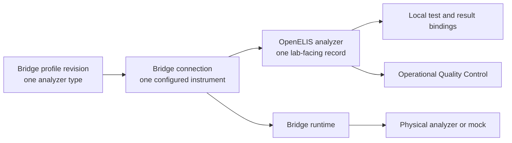

# OGC-1054 Architecture Review

**Updated:** 2026-09-02

**Delivery state:** [authoritative roadmap](../roadmaps/ogc-1054-analyzer-feature-roadmap.md)

**Product contract:** [functional specification](./spec.md)

This is a stable review aid, not another status ledger. The roadmap alone names
the active checkpoint and pull-request state.

## Verdict

The stacked implementation follows the approved ownership boundary and provides
the main profile, mapping, guided-setup, connection, activation, result, and QC
surfaces. It is not an accepted MVP because human review found incomplete
profile authoring, mapping/attention, connection/QC, and result-review behavior.
Those findings are now the four bounded M4 remediation slices in the roadmap.

## Product Model

There are three objects, with one authority for each:

| Object              | Authority | Meaning                                                                                                              |
| ------------------- | --------- | -------------------------------------------------------------------------------------------------------------------- |
| Profile revision    | Bridge    | Immutable analyzer-type behavior and defaults for a new connection                                                   |
| Analyzer connection | Bridge    | Durable entered settings, exact profile pin, revision, probe evidence, and runtime state                             |
| Analyzer            | OpenELIS  | Name, lab units, Bridge connection reference, local bindings, verification, activation intent, results, and QC links |

`Analyzer Type` is the lab-facing composition of a Bridge profile and its local
OpenELIS catalog binding. It is not another profile implementation.

## One User Workflow

1. A lab administrator opens **Analyzers** and starts **Add Analyzer** inline.
2. They choose an Analyzer Type, name the physical instrument, and assign lab
   units.
3. They review the type's local Test, Result Option, and control-recognition
   bindings.
4. OpenELIS asks Bridge to create a connection pinned to the chosen profile
   revision.
5. OpenELIS renders Bridge-described setup fields and submits values back to
   that connection without interpreting or storing them as runtime authority.
6. The user runs a visible connection test, reviews blockers, and activates the
   analyzer. Probe success is evidence, not an activation gate.
7. Bridge receives and normalizes traffic. OpenELIS binds known results, holds
   unknowns, and routes recognized controls into the separate QC workflow.

The UI remains coherent in OpenELIS. Moving connection authority to Bridge does
not create a second admin application.

## Ownership Test

The boundary is correct only when all of these are true:

- A valid profile may add, remove, or change a setup field without an OpenELIS
  production-code or schema change.
- Restarting Bridge restores the exact active connection and profile revision
  without OpenELIS replaying a complete runtime definition.
- OpenELIS can be inspected without finding an analyzer IP address, port,
  credential, watch directory, delimiter, protocol mode, parser choice, or
  other analyzer-facing value as configuration authority.
- Operational QC changes neither analyzer verification nor activation.
- Production behavior contains no branch for a named analyzer, profile ID,
  vendor, model, test code, or fixture.

## Profile Contract

A profile has exactly two jobs:

1. define communication and runtime behavior for one analyzer type; and
2. provide defaults for creating a new connection of that type.

The existing Bridge profile system is evolved in place. M1 must not introduce a
second profile family, frontend defaults, or server constants that duplicate
profile content.

### Required In Every Published Revision

| Section                 | Requirement                                                                                                            |
| ----------------------- | ---------------------------------------------------------------------------------------------------------------------- |
| Identity                | Stable profile ID, immutable revision, display name, manufacturer/model metadata, lifecycle state                      |
| Runtime                 | Complete protocol-conditional framing, transport, direction, identification, extraction, aggregation, and capabilities |
| New-connection defaults | Stable field keys, input type, requiredness, choices/conditions, and safe defaults where a default is valid            |
| Vocabulary              | Every evidence-backed emitted test/result concept and portable coding hints                                            |
| Control recognition     | Explicit `RULES` definition or an affirmed `NONE`; no hidden fallback                                                  |

Protocol-specific sections are required only when that protocol needs them.
Secrets and site-specific values may intentionally have no default. Portable
coding hints are optional; an OpenELIS database identifier is forbidden.

### Never In A Profile

- a concrete analyzer connection, site address, credential, or watch directory;
- an OpenELIS lab unit, Test ID, Result Option ID, or operational-QC policy;
- mutable shared state or an instruction to repoint existing connections; or
- a hidden classifier, analyzer-name switch, or compatibility fallback.

MVP runtime publication is limited to the evidence-backed GeneXpert ASTM,
FluoroCycler FILE, and QuantStudio FILE profiles. Other files are curated and
returned one by one after contract and mock-transport proof; they are not
carried as a legacy catalog.

## Architecture Guardrails

- Bridge owns one evolved profile system, durable profile-pinned connections,
  setup descriptors, entered runtime values, probes, protocols, parsing,
  control recognition, and FILE transport.
- OpenELIS owns the composed Analyzer Types workflow, local catalog bindings,
  lab units, verification and audit, activation intent, held results, review,
  alerts, and separate operational QC.
- OpenELIS renders Bridge-described setup fields without storing or interpreting
  analyzer-facing configuration.
- There is one type-level mapping editor and one held-result workflow. There is
  no local profile registry, per-analyzer mapping editor, duplicate pending
  queue, or direct-to-OE mock path.
- `AnalyzerQcRule`, `QcRun`, an OE FILE poller, protocol-specific OE setup,
  full-state registration/replay, and hidden classifier fallbacks do not exist
  at G0.
- Every retained behavior is proven positively by owner tests and assembled
  behavior; deleted pathways are not preserved by compatibility guards.

## Released-Data Migration

OpenELIS release `3.2.2.0` already contains analyzer runtime fields. A real
upgrade therefore needs a one-time migration, even though the feature is new
and no legacy runtime is allowed at G0.

1. Quiesce analyzer configuration changes and analyzer traffic.
2. Add the durable Bridge connection contract and an additive OpenELIS
   connection reference.
3. Run a repository-owned `plan` operation that reports every source analyzer
   as migratable, needing correction, or intentionally excluded. It must not
   infer a profile from names or silently invent values.
4. Apply idempotently: create the pinned Bridge connection, verify its durable
   revision, and record the reference in OpenELIS.
5. Restart Bridge and verify that each migrated active connection restores
   exactly.
6. Remove the old writer, reader, endpoints, schema fields, migration utility,
   and superseded tests before G0. Resume traffic only after verification.

This is a bounded upgrade operation, not a dual writer or compatibility path.
The analyzer demo data may be reset rather than migrated.

## Acceptance Remediation

`openelis-work@main` supplies functional and visual intent only. Grist review
of the assembled feature identified four bounded acceptance gaps:

| Slice                 | Reviewer-visible accepted behavior                                                                                                                   |
| --------------------- | ---------------------------------------------------------------------------------------------------------------------------------------------------- |
| Profile lifecycle     | Create reaches an editable, publishable draft; duplicate is single-submit, preserves lineage and local mapping work, and leaves its source unchanged |
| Mapping and attention | Observed unknown tests/values affect completeness and attention and can be resolved through valid local catalog choices                              |
| Connection and QC     | Latest probe evidence survives reload; control lots save using only mapped Tests; profile names are user-facing                                      |
| Result review         | Normal, held, control, and FILE rows show analyzer/source context; an externally resent value follows the newly confirmed mapping                    |

The roadmap owns implementation order, pull-request state, test layers, and exit
gates. Corrections land in the earliest owning existing pull request and are
restacked into the active integrated checkpoint. No parallel remediation stack
or additional status document is created.

The 17 Grist steps are synchronized after the automated remediation slices pass.
Final human review uses one unchanged deployment, an external demo operator for
analyzer traffic, and the exact build/checklist metadata emitted by the review
overlay. Prior reports remain useful findings but do not accept changed code.

## Review Sources

- [Functional specification](./spec.md)
- [Authoritative roadmap](../roadmaps/ogc-1054-analyzer-feature-roadmap.md)
- [`openelis-work@main` analyzer designs](https://github.com/DIGI-UW/openelis-work/tree/main/designs/analyzer-integration), functional and visual intent only
- [OGC-1057 design QA findings](https://github.com/DIGI-UW/openelis-work/blob/qa/ogc-1057-guided-setup-report/designs/analyzer-integration/ogc-1057-qa-report.md)
- [R0 pull request #4049](https://github.com/DIGI-UW/OpenELIS-Global-2/pull/4049)
- [Active OpenELIS M4 pull request #4138](https://github.com/DIGI-UW/OpenELIS-Global-2/pull/4138)
- [Active Bridge M4 pull request #49](https://github.com/DIGI-UW/openelis-analyzer-bridge/pull/49)
- [Active analyzer-mock M4 pull request #42](https://github.com/DIGI-UW/analyzer-mock-server/pull/42)
