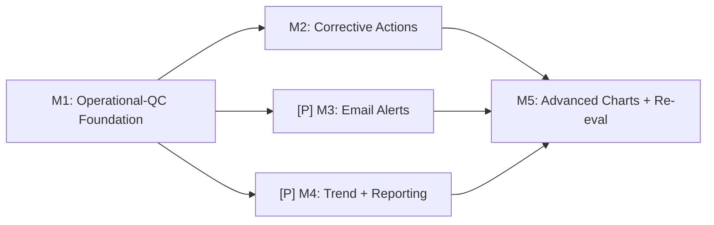

# Implementation Plan: Westgard QC Rules Dashboard

> **Superseded analyzer-identification plan:** The operational-QC portions of
> this plan remain historical implementation context. Any task, component, or
> data model involving `AnalyzerQcRule`, OpenELIS-pushed classifiers, or
> profile-to-rule copying is superseded by the
> [OGC-1054 authoritative roadmap](../roadmaps/ogc-1054-analyzer-feature-roadmap.md)
> and must not be executed or extended. Git history preserves the original
> plan; this notice is the current direction.

**Branch**: `feat/qc_westgard_rules` | **Date**: 2026-04-13 | **Spec**:
[spec.md](spec.md) **Jira**:
[OGC-41](https://uwdigi.atlassian.net/browse/OGC-41) | **Design**:
[westgard-rules.md](https://github.com/DIGI-UW/openelis-work/blob/main/designs/quality/westgard-rules.md)

## Summary

Implement a Westgard-rules-based operational quality control system for
laboratory instruments, covering control lots and results, statistical
evaluation of 8 standard rules, a real-time compliance dashboard with
Levey-Jennings charts, and configurable alerting. Bridge profile-owned
control-result recognition is an external input boundary governed by OGC-1054,
not configurable operational-QC state in this plan. OpenELIS does not send a
classifier to Bridge, and operational QC does not gate analyzer activation.

## Technical Context

**Language/Version**: Java 21 LTS (Spring MVC 6.2) + React 17 (JavaScript)
**Primary Dependencies**: Spring Framework, Hibernate/JPA, Carbon React, Carbon
Charts **Storage**: PostgreSQL 14+ via JPA/Hibernate, Liquibase 4.8.0
**Testing**: JUnit 4 + Mockito (backend), Jest (frontend), Playwright (E2E)
**Target Platform**: Docker-composed web application (OE + bridge + mock)
**Performance Goals**: Dashboard loads in <3s, rule evaluation <2s per result,
chart renders <2s for 100 data points **Constraints**: Evaluation must not block
analyzer ingestion pipeline (async); all QC data immutable for audit
**Scale/Scope**: 100+ instruments, 1000 QC results/day, 2-year data retention

## Constitution Check

- [x] **Configuration-Driven**: No country-specific code branches;
      control-result recognition comes from published Bridge profiles and
      operational Westgard settings come from OpenELIS application data
- [x] **Carbon Design System**: All QC UI uses @carbon/react (dashboard tiles,
      charts via Carbon Charts, forms, tables)
- [x] **FHIR/IHE Compliance**: QC observations tagged via FHIR R4 meta.tag;
      bridge→OE communication uses FHIR Bundles
- [x] **Layered Architecture**: 5-layer pattern followed — QCControlLot
      (Valueholder) → QCControlLotDAO → QCControlLotService → QCRestController →
      QCControlLotForm. @Transactional in services only.
- [x] **Test Strategy**: OpenELIS unit/integration tests, Bridge and
      analyzer-mock contracts, RTL with a real router, and visible-only
      Playwright stories provide current evidence at their owning layers
- [x] **Schema Management**: Liquibase for OpenELIS operational-QC tables;
      recognition remains in immutable Bridge profile revisions rather than an
      OpenELIS classifier table or seed data
- [x] **Internationalization**: All QC UI strings use React Intl (QC dashboard,
      charts, Westgard configuration, control-lot setup, and alerts)
- [x] **Security & Compliance**: RBAC (GLOBAL_ADMIN + LAB_SUPERVISOR),
      sys_user_id audit trail on all entities, violations immutable

## Milestone Plan

### Current State

**Implementation**: PR #3390 supplied the OpenELIS operational-QC foundation.
Its OpenELIS-owned analyzer classifier and Bridge-pulled rule path are
superseded and removed by OGC-1054; they are not evidence for this plan.

**Acceptance path**: service and integration tests prove OpenELIS operational
QC; Bridge contracts and analyzer-mock traffic prove profile-owned recognition;
RTL proves Carbon and routed interaction; Playwright proves only assembled,
visible user stories. The OGC-1054 M3, M4, and G0 checkpoints own linked-QC,
traffic, deployment, and human acceptance.

### Milestone Table

| ID         | Branch Suffix         | Scope                                                                                                        | User Stories   | Verification                                                                                                         | Depends On |
| ---------- | --------------------- | ------------------------------------------------------------------------------------------------------------ | -------------- | -------------------------------------------------------------------------------------------------------------------- | ---------- |
| **M1**     | m1-mvp                | QC pipeline + dashboard + charts + alerts + Westgard config + profile-owned recognition boundary             | US1-7 (all)    | OpenELIS tests, Bridge contracts, RTL, and a visible local harness story pass                                        | -          |
| **M2**     | m2-corrective-actions | Corrective action workflow: entity, service, UI (recalibration, maintenance, repeat control, reagent change) | FR7            | Corrective action CRUD + link to violations; violation cannot close without corrective action for REJECTION severity | M1         |
| **[P] M3** | m3-email-alerts       | Email notification transport + per-user notification preferences                                             | FR11.2-11.7    | Email sent on violation; user can configure which severities trigger email                                           | M1         |
| **[P] M4** | m4-trend-reporting    | Trend analysis charts + reporting (PDF/CSV export) + violation history log                                   | FR10, FR12     | Trend graph renders; PDF export works; violation log filterable                                                      | M1         |
| **M5**     | m5-advanced-charts    | Chart zoom/pan, multi-level subplots, manual re-evaluation, preview mode                                     | FR5, FR9.6-9.8 | Chart interactions work; re-evaluation produces results without persisting                                           | M2, M3, M4 |

### Milestone Dependency Graph



### PR Strategy

- **M1**: lands as the current stacked PR #3390 →
  `fix/madagascar-accession-results-file-e2e` → `develop`. Includes spec + all
  implementation + test completion work.
- **M2-M5**: each as a separate PR from `feat/OGC-41-westgard-qc-m{N}-{desc}` →
  `develop`, opened after M1 merges.

---

## M1: Operational-QC Foundation — Acceptance Plan

The historical implementation supplies a foundation. Acceptance requires the
current code and the amended architecture boundary to pass the following
coverage and validation work:

### M1.1 End-to-end flow validation (local harness)

**Goal**: Prove the full pipeline works: create lot → send mock QC result →
z-score computed → Westgard evaluation → violation created → dashboard shows it.

**Steps**:

1. Create a control lot for HIV Viral Load on QuantStudio 5 (manufacturer-
   fixed, mean=1000, SD=50)
2. Use the mock server to generate a QC file with a specimen ID "CNEG001" and
   result value 1180 (z=3.6, should trigger 1-3s REJECTION)
3. Drop the file into the QuantStudio watched directory
4. Verify: QCResult created with z-score ~3.6
5. Verify: QCRuleViolation created for 1-3s rule
6. Verify: QCAlert created for active users
7. Verify: Dashboard shows QuantStudio 5 in RED (out of compliance)
8. Verify: Levey-Jennings chart shows the violated point highlighted

### M1.2 Playwright QC smoke test

**Goal**: One E2E test proving the QC dashboard route + API + UI renders in CI.

**Test outline**:

- Authenticate as admin
- Navigate to `/analyzers/qc/db`
- Assert: QCSummaryTiles visible with numeric counts
- Assert: InstrumentsTab renders at least one instrument card
- Click an instrument card
- Assert: navigated to `/analyzers/qc/instruments/:id`
- Assert: breadcrumb trail visible
- Navigate to `/analyzers/qc/control-lots`
- Assert: list page renders

### M1.3 REST controller tests

**Goal**: Verify Spring wiring for QC endpoints (QCRestController,
QCChartDataRestController, QCViolationRestController).

**Tests**:

- GET `/rest/qc/dashboard/summary` → 200 + correct shape
- GET `/rest/qc/dashboard/instruments` → 200 + array
- GET `/rest/qc/control-lots` → 200 + array
- POST `/rest/qc/controlLot` → 201 + lot created
- GET `/rest/qc/charts/{lotId}` → 200 + chart data shape
- GET `/rest/qc/violations` → 200 + array
- POST `/rest/qc/violations/{id}/acknowledge` → 200

### M1.4 Cleanup

- Remove unused PropTypes import from QcRuleBuilderModal.jsx
- Remove the `003-westgard-qc` branch (superseded by OGC-41 naming)
- Verify CI fully green (Build+Test, Static, Frontend, E2E)

---

## M2: Corrective Actions (est. 1-2 weeks)

**Design ref**:
[FR7 — westgard-rules.md](https://github.com/DIGI-UW/openelis-work/blob/main/designs/quality/westgard-rules.md)

**New entities**:

- `QCCorrectiveAction`: action type (RECALIBRATION, MAINTENANCE, REPEAT_CONTROL,
  REAGENT_CHANGE, OTHER), assigned user, status (PENDING/IN_PROGRESS/COMPLETED),
  resolution notes

**Backend**:

- `QCCorrectiveActionService` + DAO + REST controller
- Link violations to corrective actions (FK on `qc_rule_violation`)
- Auto-resolve violation when corrective action completed
- Block patient result release for associated samples until resolved (FR7.7)

**Frontend**:

- Corrective action form (inline within violation detail, not modal)
- Status tracking in AlertsTab (PENDING → IN_PROGRESS → COMPLETED)
- Assignment dropdown (active system users)

---

## M3: Email Alerts (est. 1 week, parallel with M2)

**Design ref**:
[FR11 — westgard-rules.md](https://github.com/DIGI-UW/openelis-work/blob/main/designs/quality/westgard-rules.md)

**Backend**:

- Wire `QCAlertService` to the existing email infrastructure (Spring Mail)
- Email template with: instrument, test, rule violated, z-score, link to detail
- Per-user notification preferences (entity + admin UI)
- Respect 15-minute batching for WARNING severity

**Frontend**:

- User preferences page (which severities trigger email)
- Admin config for SMTP settings (if not already global)

---

## M4: Trend Analysis + Reporting (est. 2 weeks, parallel with M2)

**Design ref**:
[FR10, FR12 — westgard-rules.md](https://github.com/DIGI-UW/openelis-work/blob/main/designs/quality/westgard-rules.md)

**Backend**:

- `QCTrendService`: compliance percentage over time, violation frequency by rule
  type, instruments with recurring violations
- Report generation service (PDF via iText or similar, CSV via streaming)
- Filterable violation history log endpoint

**Frontend**:

- Trend graphs (Carbon Charts line/bar) with date range + instrument + test
  filters
- Export buttons (PDF, CSV) on dashboard and chart pages
- Violation history page with sorting, pagination, filtering

---

## M5: Advanced Charts + Manual Re-evaluation (est. 1-2 weeks)

**Design ref**:
[FR5, FR9.6-9.8 — westgard-rules.md](https://github.com/DIGI-UW/openelis-work/blob/main/designs/quality/westgard-rules.md)

**Backend**:

- `POST /rest/qc/evaluate-range`: on-demand rule evaluation for a date range
- Preview mode: return results without persisting violations
- Re-evaluation after statistics recalculation

**Frontend**:

- Chart zoom and pan (Carbon Charts supports this natively; wire it up)
- Multi-level subplots (Low/Normal/High tabs or separate chart rows)
- Print/export chart to PDF/PNG
- Manual evaluation controls (date range picker, "Evaluate" button, preview
  toggle)

---

## Project Structure

### Documentation

```text
specs/OGC-41-westgard-qc/
├── spec.md              # Feature specification (this feature)
├── plan.md              # This implementation plan
├── checklists/
│   └── requirements.md  # Spec quality checklist
├── research.md          # (to be created if needed)
├── data-model.md        # (to be created for M2+)
└── contracts/           # (to be created for M2+)
```

### Source Code

```text
# Backend (QC module)
src/main/java/org/openelisglobal/qc/
├── controller/          # QCRestController, QCChartDataRestController, QCViolationRestController
├── dao/                 # QCControlLotDAO, QCResultDAO, WestgardRuleConfigDAO, etc.
├── service/             # QCResultService, WestgardRuleEvaluationService, QCAlertService, etc.
├── evaluator/westgard/  # 8 rule evaluators (Spring @Component auto-discovered)
├── listener/            # QCResultCreatedEventListener (@Async, AFTER_COMMIT)
├── form/                # QCControlLotForm, WestgardRuleConfigForm
└── valueholder/         # QCControlLot, QCResult, QCStatistics, QCRuleViolation, QCAlert

# Frontend (QC components)
frontend/src/components/qc/
├── dashboard/           # QCDashboard, QCSummaryTiles, InstrumentsTab, AlertsTab, InstrumentDetailPage
├── charts/              # LeveyJenningsChart, ControlChartDetail
├── controlLots/         # ControlLotList, ControlLotSetup, StatisticsConfigModal
├── ruleConfig/          # RuleConfigPanel, RuleConfigFormModal
└── index.js             # Module exports

# OpenELIS analyzer integration
src/main/java/org/openelisglobal/analyzer/
└── ...                  # Analyzer-to-QC context link only; no recognition classifier

# Analyzer Bridge repository
src/main/java/org/itech/ahb/profile/
├── ...                  # Profile validation, immutable revisions, recognition evaluation
└── ...                  # Human-readable recognition authoring and summaries

# Liquibase — OpenELIS operational QC only
src/main/resources/liquibase/
└── qc/                  # 001-create-qc-tables.xml (control lot, result, statistics)
                         # 002-create-westgard-rule-config.xml
                         # 003-create-qc-violation-tables.xml
                         # (no 004 — numbering reserved; 004-series lives in analyzer/)
                         # 005-create-qc-alert.xml
                         # 006-fix-lastupdated-column.xml
                         # 007-add-qc-menu-items.xml
                         # 008-add-instrument-fk-constraints.xml
```

## Testing Strategy

**Reference**:
[OpenELIS Testing Roadmap](../../.specify/guides/testing-roadmap.md) and
[Playwright best practices](../../.specify/guides/playwright-best-practices.md)

**Note**: This project has deprecated Cypress E2E (per CLAUDE.md). All new E2E
tests use **Playwright** with the harness-foundational / harness-demo project
structure. Use `/plan-record-playwright`, `/write-playwright-test`,
`/audit-playwright`, `/debug-playwright` skills for E2E work.

### Coverage Goals

- **Backend**: >80% code coverage for new OpenELIS operational-QC behavior
- **Frontend**: >70% coverage for new routed QC components and interactions
- **Critical Paths**: 100% coverage for z-score calculation, rule evaluation
  logic, and violation creation

### Test Types

- [ ] **Unit Tests**: cover services, evaluators, calculators, and event
      listeners with current passing evidence
- [ ] **DAO Tests**: cover control-lot, result, violation, and alert persistence
- [ ] **Controller Tests**: QCRestController, QCChartDataRestController,
      QCViolationRestController — M1 completion target
- [ ] **ORM Validation Tests**: validate all retained operational-QC mappings
- [ ] **Bridge Tests**: prove pinned-profile recognition, explicit `NONE`, and
      absence of OpenELIS-pushed or hard-coded fallback classifiers
- [ ] **Frontend Unit Tests**: use RTL with a real router for Carbon behavior,
      URL state, headings, and breadcrumbs
- [ ] **E2E Tests (Playwright)**: exercise visible user stories only, with no
      API assertions, backend polling, forced controls, or arbitrary waits

### Test Data Management

- **Backend unit**: Test builders (QCControlLotBuilder, QCResultBuilder, etc.)
  for consistent fixture generation
- **Backend integration**: DBUnit XML fixtures
  (`src/test/resources/testdata/ qc-*.xml`) with transaction rollback
- **E2E**: a deterministic fixture loader may establish preconditions; all
  acceptance actions and assertions occur through visible UI

### Required Validations

- **Entities**: current ORM validation tests pass.
- **Services**: current operational-QC service and evaluator tests pass.
- **Controllers**: current controller integration tests pass.
- **Frontend**: focused RTL and the visible Playwright QC story pass.
- **Boundary**: Bridge and analyzer-mock contracts prove pinned-profile
  recognition and the OpenELIS removal guard passes.
